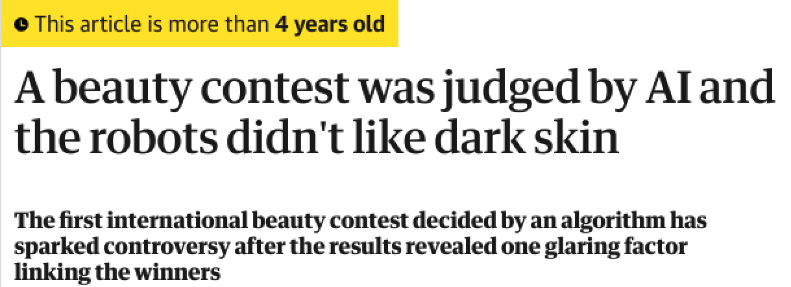
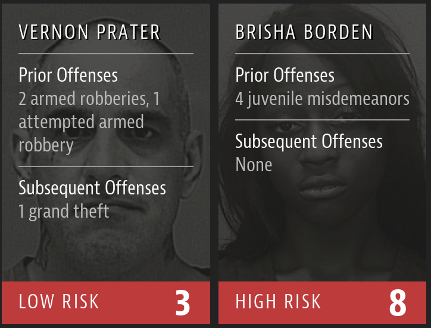
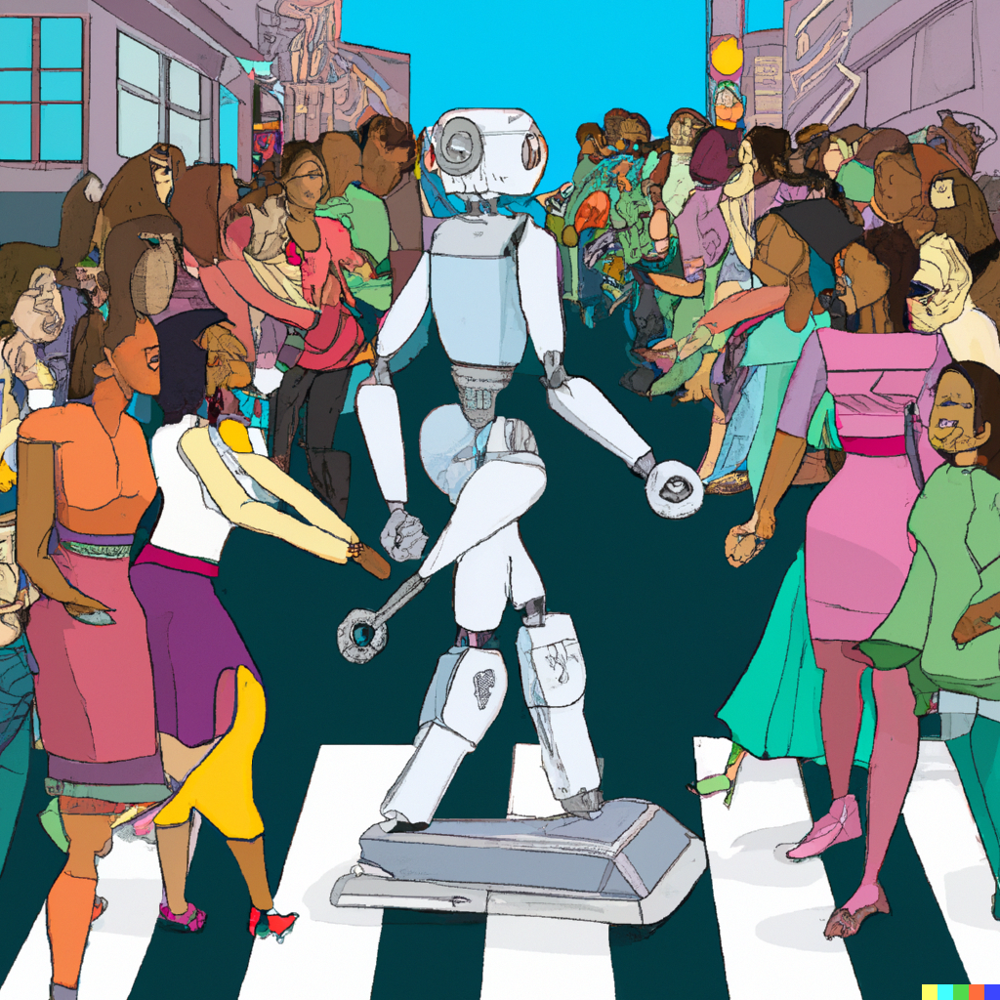

<!-- _class: lead -->

# Trustworthy AI:   Fairness, Interpretability   and Privacy 
**Lecturer**:
Mattia Cerrato 📧 mcerrato@uni-mainz.de 🌐 https://pibborn.github.io

 
 

 Image generated by OpenAI dall-e
 *Prompt:* "a robot sits in the middle of a crossing in a busy street. people of different ethnicities walk past the robot. comic style"

 

---

## Instructor: Mattia Cerrato 

 

**Post-Doc** at the Data Mining Group, JGU

**Principal Investigator** for the TOPML project, JGU

Ph.D. in Computer Science from University of Torino, Italy

 

**Research interests**:
* Fairness in Neural Networks
* Interpretability in Deep Learning
* Reinforcement Learning

---

## Class Information

 

**Lecture**: Tuesdays 10-12AM, Room 04-426

 

**Tutorials**: Thursdays 2-4PM

 

**Final Exam**: oral examination - but open to discussion if someone is not confortable doing that in English

**Grading**: 70% final exam + 30% tutorials (coding, short essays)

 

Classes will be held **in presence** until it is possible/reasonable to do so. 

---

## Class Information

 

 

Please subscribe to the MS Teams Group: https://bit.ly/trust-ai-jgu

 

Assignments and important communication will be mostly be delivered via Teams. 

---

## Class Schedule

TODO

---

## Reference books

 

Russell and Norvig. **AI: A modern Approach**. 4th Edition.
 

Barocas, Hardt and Narayanan. **Fairness and Machine Learning. Limitations and opportunities**. https://fairmlbook.org/

 

**Plus**: articles distributed in class / via Teams.

---

## What is Trustworthy AI?

 
 

The study of how AI techniques, methodologies and applications may be made **reliable**, **dependable** and **aligned with human values**.

 Image generated by OpenAI dall-e
 *Prompt:* "a trustworthy robot helping an old lady cross a busy street, realistic"

 

---

## What is Trustworthy AI

An AI system may be understood as the sum of its parts:

* **Data**, as the input "experience" which needs to be taken into account - this does not need to be **big** data. 
* **Algorithms**, as the means to process the above data so to obtain 
* **Decisions** which we may employ directly or use as assistance for our own.

---

## What is Trustworthy AI

Simple example: the **thermostat** [Russell and Norvig, Chapter 1]

* **Data**: your choice of desired temperature for your rooms and water, possibly depending on the time of day / year; the current temperature 
* **Algorithm**: if the current temperature is lower than desired: activate. If it is higher: deactivate.
* **Decisions**: whether to activate the heating system or not.

How do we know if this system is **trustworthy**, i.e. reliable and dependable?

---

## What is Trustworthy AI

We should be able to agree that the thermostat is trustworthy when it makes **a limited amount of mistakes**, that is, it follows our instructions closely and timely. 

 

Possible measure of **success**: not getting a huge energy bill at the end of the year.

 

---

## What is Trustworthy AI

 

Complicated example: **selecting people for a finance job interview**

**Data**, **algorithm**, **measure of success**: any suggestions?

---

## What is Trustworthy AI

Some ideas:

* A quantitative background
* Some classes on stochastics 
* Nice portfolio of projects / internships
* Good grades
* Degree obtained in a very good/competitive school

Many more are possible. Is it simple to **explicitly enumerate all the requirements**, and come up with a procedure to compute our decisions?

---

## Clinical vs. Actuarial Judgement

 

>In the **clinical method** the decision-maker combines or processes information in his or her head. In the **actuarial** or **statistical method** the human judge is eliminated and conclusions rest solely on empirically established relations between data and the condition or event of interest."

Dawes, Faust and Meehl, 1989. *Science*. Emphasis mine.

---

## Clinical vs. Actuarial Judgement

 
 

A "**clinical AI method**" relies on a set of pre-determined rules, given by a domain expert.

 

An "**actuarial/statistical AI method**" looks at **past data** to **predict future outcomes**. 

---

## Acturial Judgement in AI 

Another difficult example (for computers): **what can you see in this image**?

 

---

## Actuarial Judgement in AI

 
 

AI researchers found it **impossible** to solve this problem via clinical judgement, i.e. a full enumeration of what a "baby", "lego brick" is under all possible circumstances.

Imagine even trying! If a certain group of pixels is pink... well, not necessarily pink... and if two groups of pixels contain another group which is circular... then you have a face?

This may seem reasonable to us now, but it was relatively surprising after the first few successes of clinical-style AI.

---

## Actuarial Judgement in AI

 

---

## Actuarial Judgement in AI

 

> The primary goal of the project is to construct a system of programs which will divide a vidisector picture into regions such as likely objects, likely background areas and chaos. [...] The final goal is OBJECT IDENTIFICATION which will actually name objects by matching them with a vocabulary of known objects.

  

It would take us ~45 years to get acceptable results. 

---

## Actuarial Judgement in AI

 

What happened in the meantime?

* **Machine learning** techniques - "actuarial AI" - made huge theoretical and technological progress.
* More and more researchers realized the importance of **developing massive datasets** from which actuarial judgement techniques can show their power. 

---

## Actuarial Judgement in AI

 

Nowadays, machine learning models are hosted on your phone and may create galleries for you: family, friends, pets, trip to London, etc. This was enabled by the creation of **1M+ image databases** (e.g. ILSVRC). 

Voice-based assistants are also "powered by ML". Speech-to-text models require **thousands of hours** of audio data (e.g. PeopleSpeech).

Of course, hard to imagine this happening without the Internet.

---

## Actuarial Judgement in AI

From Goodfellow, Bengio and Courville. Deep Learning. MIT Press, 2016

---

## Actuarial Judgement in AI

 

Of course, the resurgence of **deep learning** techniques - i.e. neural networks - played no small part in this.

Compared to other **actuarial** methodologies which explicitly represent and manipulate probability distributions (Hidden Markov Models, Gaussian Mixture Models, Bayesian Networks...), they show a higher capacity to **scale to massive amounts of data**. 

The reasons why this is true are well beyond the scope of this class, and we will treat it as an experimental fact. 

---

## A few ML success stories

Automatic classification of images in your "Gallery" app via **object detection**

---

 

## A few ML success stories

Forbes , black individuals misclassified

---

## A few ML success stories

 

 

A "beauty pageant algorithm"

---

## A few ML success stories

 

 

Guardian, mostly white winners in the AI Beauty Pageant

---

## A few ML success stories

---

## A few ML success stories

---

## A few ML success stories 

Reuters: Amazon scraps secret AI recruiting tool that showed bias against women

---

## A few ML success stories 

>“Everyone wanted this holy grail,” one of the people said. “They literally wanted it to be an engine where I’m going to give you 100 resumes, it will spit out the top five, and we’ll hire those.”

---

## A few ML success stories 

>[...] Amazon’s computer models were trained to vet applicants by observing patterns in resumes submitted to the company over a 10-year period. Most came from men, a reflection of male dominance across the tech industry.

---

## A few ML success stories 

>[...] It penalized resumes that included the word “women’s,” as in “women’s chess club captain.” And it downgraded graduates of two all-women’s colleges, according to people familiar with the matter. 

---

## How does this happen?

 
 
 

Please discuss!

Image generated by OpenAI dall-e. 
*Prompt*: a robot discriminating against minorities by pushing black people and women in the middle of a busy street. comic style

---

## How does this happen?

 

Points for discussion:

* Are the algorithms **sexist/racist**?
* Who is at fault here?
* How did the engineers not notice these issues before deployment?
* Is any of this illegal?

Image generated by OpenAI dall-e. 
*Prompt*: a robot discriminating against minorities by pushing black people and women in the middle of a busy street. comic style

---

## How does this happen?

**Are Emily and Greg More Employable than Lakisha and Jamal? A Field Experiment on Labor Market Discrimination.**  Bertrand and Mullainathan. 2003

 

>We perform a field experiment to measure racial discrimination in the labor market. We respond with fictitious resumes to help-wanted ads in Boston and Chicago newspapers. To manipulate perception of race, each resume is assigned either a very African American sounding name or a very White sounding name. The results show significant discrimination against African-American names: **White names receive 50 percent more callbacks for interviews**. We also find that race affects the benefits of a better resume. For White names, a higher quality resume elicits 30 percent more callbacks whereas for African Americans, it elicits a far smaller increase.

---

## US only?

**Ethnic Discrimination in Germany’s Labour Market: A Field Experiment.** Kaas and Manger, 2010. 

 

>To each of 528 advertisements for student internships we send two similar applications, one with a Turkish-sounding and one with a German-sounding name. **A German name raises the average probability of a callback by about 14 percent.** Differential treatment is particularly strong and significant at smaller firms at which the applicant with the German name receives 24 percent more callbacks. Discrimination disappears when we restrict our sample to applications including reference letters which contain favourable information about the candidate’s personality.

---

## How does this happen?

 

Dawes, Faust and Meehl, 1989.

>In the clinical method the decision-maker combines or processes information in his or her head. In the **actuarial** or statistical method **the human judge is eliminated** and conclusions rest solely on empirically established relations between data and the condition or event of interest."

 

Is it ever?

---

## How does this happen?

 
 

Actuarial AI is often **opaque**, meaning that it is difficult / impossible to understand **why** a certain AI system has made a particular decision

While it is possible to **inspect** a model's parameters (its **algorithm**), connecting it to the actual decisions is another matter entirely

This is especially true for deep neural networks

---

## How does this happen?

 

From Bernstein et al. 2021, Nature Scientific Reports

---

## How does this happen?

 

"**‘It Happened So Fast’: Inside a Fatal Tesla Autopilot Accident**" NY Times. 2019

>Neither he nor Autopilot noticed that the road was ending and the Model S drove past a stop sign and a flashing red light. The car smashed into a parked Chevrolet Tahoe, killing a 22-year-old college student [...] the accident report and court filings paint a tragic picture of overreliance on technology. They also strongly suggest that Autopilot failed at a basic function — automatic emergency braking — that engineers developed years ago.

 

**How do you debug this**?

---

## Trustworthy AI

 

The aim of this class is to prepare you for the **real-world requirements** of AI development, and, above all, **real-world deployment**

It is relatively easy to write code; maintaining it is the hard part

The same holds for AI systems -- how do we ensure that nothing goes wrong? Or, how do we respond when something does go wrong?

---

## Trustworthy AI

While some of the possible situations are unique to certain application fields, here we focus on three (/four) dimensionalities:

* **Fairness**: ensuring that our models **do not discriminate** against certain groups of people
* **Interpretability**: ensuring that we can **make sense** of our models' decisions
* **Privacy**: ensuring that our analysis does not infringe people's **privacy rights**
* **Lawfulness**: ensuring that we are able to **refer to the relevant legislation** during our future work in AI development

---

## Trustworthy AI

We will often borrow from **recent research** and **developments** on this topic, and discussion is always encouraged.

 

The common theme: once an AI system is deployed to act in society, many issues and "bugs" may become **socio-technical**, not only technical.

 

---

 
 

Financed by CZS, 2022~2028

---

---

# Trustworthy AI:   Fairness, Interpretability   and Privacy 

## Thanks!

Mattia Cerrato 📧 mcerrato@uni-mainz.de 🌐 https://pibborn.github.io

