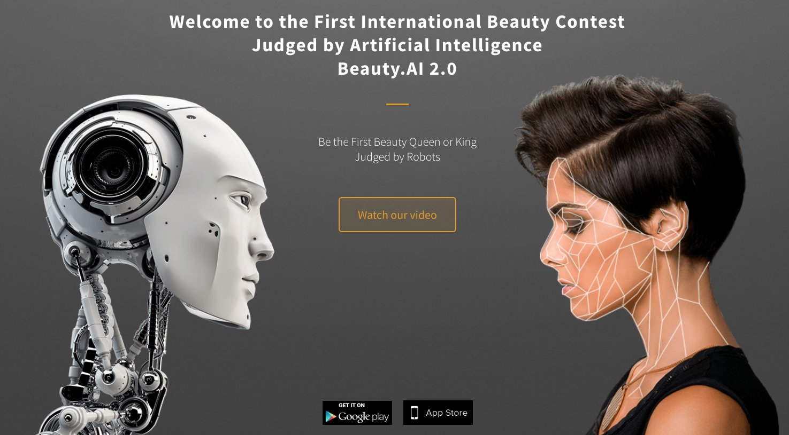
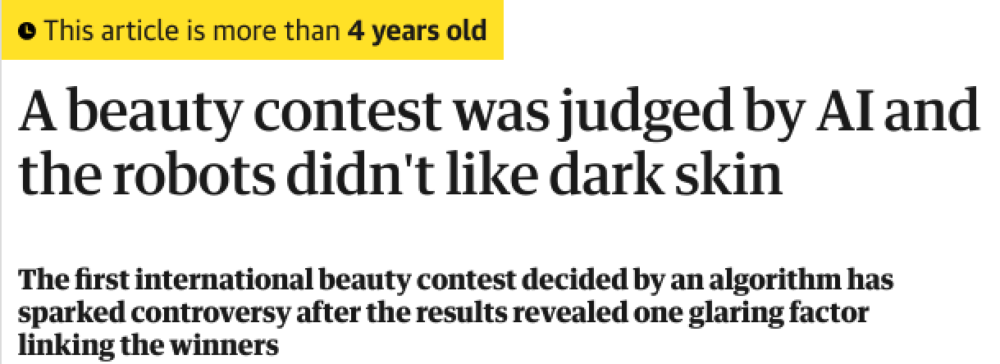
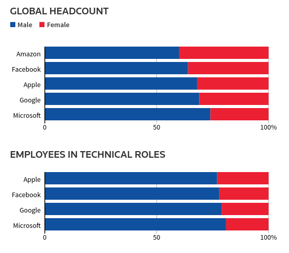
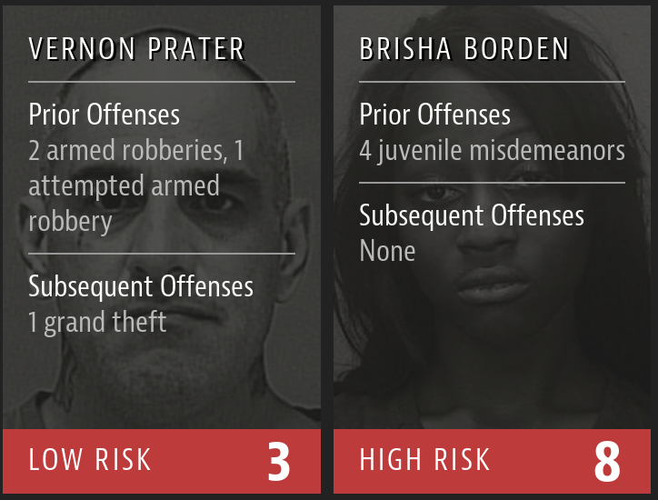
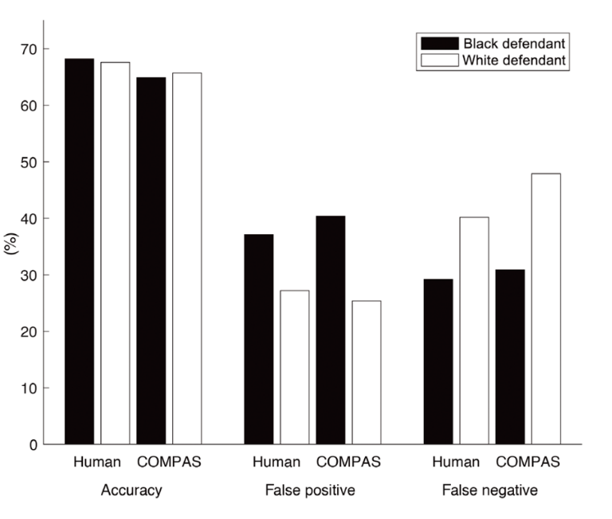
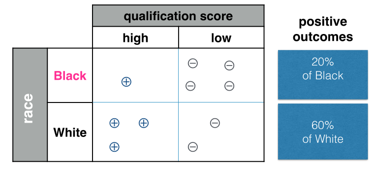
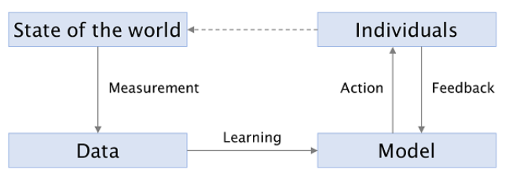
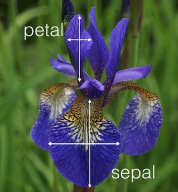

<!-- _class: lead -->

# Trustworthy AI:   Fairness, Interpretability   and Privacy 

## Lecture 2

 Image generated by OpenAI dall-e
 *Prompt:* "a robot sits in the middle of a crossing in a busy street. people of different ethnicities walk past the robot. comic style"

 

---

## Outline

* Recap 
* Models make mistakes 
* Mistakes may harm different groups of people in a disparate way
* intro to classification
* intro to fairness in classification
* again, how does this happen? example from hiring applications
* the measurement issue: measuring height
* the measurement issue: measuring future performance 

---

## A few ML success stories

 

 

A "beauty pageant algorithm"

---

## A few ML success stories

 

 

Guardian, mostly white winners in the AI Beauty Pageant

---

## A few ML success stories 

Reuters: Amazon scraps secret AI recruiting tool that showed bias against women

---

## A few ML success stories 

>“Everyone wanted this holy grail,” one of the people said. “They literally wanted it to be an engine where I’m going to give you 100 resumes, it will spit out the top five, and we’ll hire those.”

---

## A few ML success stories 

>[...] Amazon’s computer models were trained to vet applicants by observing patterns in resumes submitted to the company over a 10-year period. Most came from men, a reflection of male dominance across the tech industry.

---

## A few ML success stories 

>[...] It penalized resumes that included the word “women’s,” as in “women’s chess club captain.” And it downgraded graduates of two all-women’s colleges, according to people familiar with the matter. 

---

## How does this happen

Models/AI systems will always make **mistakes**, but the **distribution of those mistakes** may be affecting different groups of people in a disparate way 

 

As a perfect model is usually not available, the study of **fairness** in machine learning seeks to avoid situations in which certain groups are discriminated against

---

## COMPAS

---

## COMPAS

---

## COMPAS

---

## Classification - A Primer

$X$: **data**, covariates
$Y$: ground truth, labels, **target variable**

Classification is the process of determining a plausible value for $Y$ given $X$.

More technically, one seeks to learn the parameters $\theta$ of some function $f_{\theta}$ which maps the **random variable** $X$ to an estimate $\hat{Y}$ of $Y$:

 

$$\hat{Y} = f_{\theta}(X)$$

---

## Classification - A Primer

$X$: qualification score
$Y$: the person received a positive evaluation from their manager after 12 months of employment (+) or not (-) 

---

## Classification - A Primer

The process of learning parameters for $f_{\theta}$ depends on the learning algorithm and choice of representation.

As an example, for logistic regression $\theta$ is trivially a vector of real values which length is the same as the number of columns of $X$ - plus one.

However, the most natural representation for $\theta$ may be different if we seek to learn e.g. a decision tree.

For now, we will often omit the details of the specific learning algorithm - we will be talking about how to obtain the optimal $\theta$ in the next lectures. 

---

## Classification - A Primer

Abstracting away these details, we will now be looking at the **probability distributions** of our random variables $X$, $Y$ and $\hat{Y}$. 

A random variable - very informally - is a mathematical device which is employed to describe quantities which depend on random events or that are in general uncertain. 

Classic examples: dice rolling, coin flipping. If $X$ models e.g. a coin flip, we may map the outcomes heads and tails to the numbers 1 and 0.

The actual events may then be written down lowercase, e.g. $\mathbb{P}(X=x)$ where $x$ may take the values 1 and 0.

---

## Classification - A Primer

Usually, we are interested in the probability distribution of random variables - their **expected behavior**.

In coin flipping, after noticing that $\mathbb{P}(X = 1) = \mathbb{P}(X = 0) = 1/2$, we have given a full description of the process.

Of course, this does not account for cheating, magnets, magic tricks...

---

## Classification - A Primer

In classification, we are interested in how similar our estimate $\hat{Y}$ is to the given labels $Y$. 

If $P(Y = f_\theta(X)) = P(Y = \hat{Y}) = 1$, we have a perfect classifier. 

In general, $P(Y  = \hat{Y})$ is said to be the **accuracy** of our classifier - the higher, the better. 

---

## Classification - A Primer

Note that accuracy may not be very useful in some scenarios. Assume that we have a task in which we need to predict whether a pandemic is going to occur in the next year. 

In the last 2000 years, we could have gotten >99% accuracy by always predicting "no" / 0. 

While the example is unrealistic - a constant predictor $f(X) = 0$ is not much of a classifier - it does imply that we need ways to describe **classifier performance** beyond accuracy. 

---

## Classification - A Primer

 

| Event       	| Condition 	| Metric              	|
|-------------	|-----------	|---------------------	|
| $\hat{Y}=1$ 	| $Y=1$     	| True positive rate  	|
| $\hat{Y}=0$ 	| $Y=1$     	| False negative rate 	|
| $\hat{Y}=1$ 	| $Y=0$     	| False positive rate 	|
| $\hat{Y}=0$ 	| $Y=0$     	| True negative rate  	|

 

This is a representation of **conditional probability**: $\mathbb{P}(\hat{Y} \mid Y)$, the probability of the estimate **given** the label value.

---

## Classification - A Primer

Suppose that we assign a specific cost to each of the possible outcomes, depending on what we care about.

As an example, in the "pandemic prediction" task we could decide that false negatives are to be avoided at all costs and that we would assign a cost of 10 to every false negative and 1 to false positives. 

We may then define the **cost** as the real number $\ell(\hat{y}, y)$ which we obtain when we classify an example with label $y$ as $\hat{y}$.

In the example above, $\ell(0, 1) = 10$ and $\ell{1, 0} = 1$.

---

## Classification - A Primer

We now define the **optimal classifier** as the classifier which minimizes

$$ \mathbb{E}(\ell(Y, \hat{Y})) $$

where $\mathbb{E}$ is the expected value. 

For clarity: assume our cost as defined above; $Y = \{0, 0, 0, 1\}; \hat{Y} = \{1, 0, 0, 0\}$

We have, in order: false positive, true negative, true negative, false negative. $1+0+0+10=11/4=2.25$

Given a new example which we intend to predict, our **expected cost** is $2.25$. The accuracy is 50%.

---

## Classification - A Primer

Assume that another classifier gives us  $\hat{Y} = \{1, 1, 0, 1\}$ and that Y is still $\{0, 0, 0, 1 \}$; 

We have, in order: false positive, false positive, true negative, true positive. $1+1+0+0=2/4=0.5$

This classifier is better than the one we saw in the previous slide - even if its accuracy is the same. Of course, both are pretty bad and the sample size is very small.

---

## Classification - A Primer

When we choose $\ell(0, 1) = \ell(1, 0) = 1$, we are in the setup in which we just wish to minimize the number of mistakes - the **classification error**. We can show a useful property of the optimal classifier in this situation.

**Property.** The optimal classifier minimizing the classification error satisfies the following property:

$$
\hat{Y} = f(X), \; \; \text{where} \; \; f(X) = 
\begin{cases}
1 \; \; \text{if} \; \; \mathbb{P}(Y = 1 \mid X = x) > 1/2 \\
0 \; \; \text{otherwise}
\end{cases}
$$

It is possible to obtain a similar result for other choices of $\ell$ by varying the value $1/2$.

---

## Classification - A Primer

In plain English, it is possible to obtain an **optimal classifier** from some given probability values by **choosing the right threshold**. 

This notion may be extended to the concept of **risk scoring**.

---

## Classification - A Primer

A **risk score** is a function so defined:

 

$$r(x) = \mathbb{P}(Y = 1 \mid X= x) = \mathbb{E}[Y \mid X = x]$$

 

In general, optimal classifiers may be obtained by thresholding a risk score $r$. 

---

## Fair Classification

Issue: **unbalanced false positive rate**. COMPAS mistakenly assigns a "high risk" score to black people more often than to white people. 

---

## Fair Classification

Issue: **disparity in positive outcomes**. This classifier assigns positive outcomes with different rates to white and black people. 

---

## Fair Classification

Please discuss!

* Do you agree that this is an issue?
* What's wrong with these classifiers? Do they just not fit the data as accurately at possible?

---

## The ML loop

In this lecture, we have been approaching the issue (still undefined) of fairness from a machine learning standpoint - metrics, approximation, classifiers

Before diving into fairness definitions and fair classification, let us discuss **what happens in machine learning before and after we train a classifier**

---

## The ML loop

 

 

**Learning**: the process of finding good parameters $\theta$ for $f$, and possibly an optimal threshold

---

## The ML loop

 

 

**Actions**: how we employ our model's decisions to new, previously unseen inputs. Often described as "prediction", even if it is not necessarily about the future. **Examples**: deleting all emails which are classified as spam; deciding whether an individual with a certain risk score is allowed to post bail.

---

## The ML loop

 

 

**Feedback**: optionally, record how the users reacted to the undertaken actions.

---

## The ML loop

 

 

**Measurement**: the process in which the state of the world is reduced to data tables. 

---

## Measurement

In ML, and especially in ML lectures, **the measurement process is often taken for granted**.

We get data from the internet; we learn how to fit e.g. a decision tree on the data; we look at our performance metrics. 

---

## Measurement

However, **the term measurement may be misleading**. It invokes an image of a scientist painstakingly and dispassionately obtaining information about a certain phenomenon.

The word **measurement** makes us think of Galileo dropping objects from the Leaning Tower of Pisa, or a chemist carefully weighting materials for a new reaction.

When the data being measured is demographic/sociological, this metaphor may be completely untrue.

In the next few slides, we will borrow from the quantitative social sciences to describe a simple measuring process.

---

## Measurement

TODO; define operationalization via a measurement model in jacobs and wallach

also show the difference between h and h hat, probably show the graphical model

---

## Measurement

What is actually happening when we measure lengths?

Phenomenon of interest: the **theoretical construct** "length" which we define as $\mathcal{L}$. 

---

## Measurement

As we have reason to believe that $\mathcal{L}$ is an **observable property** of a certain object, we reach for our ruler and get to work.  

We want to allow for **mistakes in the measurement process**. Thus, we take N measurements $\{\hat{l}\}_{n=1}^{N}$ of the length of petal/sepal. 

Provided that our ruler is not biased, the average value of our sequence $h_1, \dots h_N$ will converge to the "true" length as $N \to \infty$.

Note that this is different than performing a single measurement for multiple flowers!

---

## Measurement

Alternative definition: our $n$-th measurement $\hat{h}_n$ is related to $h$ via an additive error - hopefully a small one.

$$\hat{h}_n = h + \epsilon_n$$

If our errors $\epsilon_n$ are: normally distributed; **independent**; and of enough small variance; then $\frac{1}{N}\sum_{n=1}^N \hat{h}_n \to h$ with probability one as $N \to \infty$.

---

## Measurement

ancora da fare: tornare all'esempio dell'assunzione e parlare di cosa sia un "buon impiegato" 

come lo definiamo?

cattive notizie! anche questo e' un modello - un modello di misurazione - la cui accuratezza puo' essere difficile da valutare

cattive notizie! la ground truth puo' avere dei bias - citazione da ultimo articolo

"raw data is an oxymoron"

---

## Measurement

Back to our **hiring example**. Last time, we thought of the following characteristics: 

* A quantitative background
* Some classes on stochastics 
* Nice portfolio of projects / internships
* Good grades
* Degree obtained in a very good/competitive school

These sound like decent features/covariates $X$ to employ and give to our classifier $f$.

---

## Measurement

These sound like decent features/covariates $X$ to employ and give to our classifier $f$.

 

However, **how may we define $Y$?**

 

Ideally, we could give our current employees scores from 0 to 1 depending on how good they are at their job and use that. 

---

## Measurement

 

What we are doing here implicitly is assuming that there is a **theoretical construct** "employee goodness" $\mathcal{G}$.

Thus, we need to come up with a **measurement model** for this theoretical construct. 

What is immediately apparent is that our job will be harder than just picking a up our favorite ruler. 

---

## Measurement

In the quantitative social sciences, such a theoretical construct would be called **unobservable**, because employee goodness does not **directly manifest itself in the world** (cfr. height).

 

Other examples: 

* Evaluating intelligence, as is sometimes done by psychologists
* Estimating socioeconomic status, of interest in economics
* Classifying political ideology

---

## Measurement

Note that **unobservable** does not mean **impossible to measure**. However, any measurement procedure will have some **level of detachment** to the abstract theoretical construct.

In practice, one needs to assume a **measurement model**, a statistical model which links the unobservable theoretical construct - which we may describe as some latent variable - to some observable property we can measure. 

---

## Measurement

Back to our example, we may decide to link $\mathcal{G}$ to the latent variable $g$, "having received a positive evaluation in the last 12 months".

How can we understand if this is a "good" measurement model?

---

## Measurement

 

>The evaluation of any measurement is generally based on its reliability (can it be repeated?) and validity (is it right?). Embedded within the complex notion of validity are interpretation (what does it mean?) and application (does it ‘work?’)

Quinn et al., *How to analyze political attention with minimal assumptions and costs.* American Journal of Political Science, 2010

---

## Measurement

Some things we should take into consideration:

* **The Amazon case study**. Do we have enough data for certain groups of people? 
* Is it possible that our performance evaluations are **biased** against certain groups?

---

## Measurement

 

>The “pro-male evaluation bias”, as some call it, generally leads women being rated lower in performance than men, even in situations where their performance has been demonstrably equal to the men’s. One study of the quality of writing in essays (researchers “varying” the sex of the author) showed similar bias, with both male and female readers rating the essays as being of lower quality if they believed the author was female.

Snipes, Thomson and Oswald. *Gender bias in customer evaluations of service quality*. Journal of Services Marketing, 2006. 

---

## Measurement

 

> At first glance data are apparently before the fact: they are the starting point for what we know, who we are, and how we communicate. This shared sense of starting with data often leads to an unnoticed assumption that data are transparent, that information is self-evident, the fundamental stuff of truth itself.

Gitelman, *Raw Data is an Oxymoron*. MIT Press, 2010.

---

## Measurement

 

> Data are familiarly “collected,”“entered,”“compiled,”“stored,”“processed,”“mined,” and “interpreted.” [...] Data need to be imagined as data to exist and function as such, and the imagination of data entails an interpretive base.

Gitelman, *Raw Data is an Oxymoron*. MIT Press, 2010.

---

## What can we do?

In the last two lectures, we have seen some examples of biased model outputs and biased data.

 

The practical takeaway: **ask questions** and **read literature**. Whenever someone asks you to develop some statistical model to perform a task, look at what people have been doing - also in other disciplines!

---

## What can we do?

 

Munroe, XKCD #1831.

---

## What can we do?

We have so far relied on an **intuitive understanding** of bias / discrimination.

The study of fairness in ML proposes a number of specific ways to measure the "fairness" of a classification model. 

Some specific procedures to obtain "fair" models are also possible. 

Nonetheless, we **should not avoid the hard questions** which may come from the ML loop. 

---

## What can we do?

 

---

## What can we do?

Note that what we have said today **is also true about the theoretical construct of fairness**. 

 

How do measure it? Which assumptions are we making?

 

This will be the topic of the next few lectures. 

---

<!-- _class: lead -->

# Trustworthy AI:   Fairness, Interpretability   and Privacy 

## Lecture 2

## Thanks!

 Image generated by OpenAI dall-e
 *Prompt:* "a robot sits in the middle of a crossing in a busy street. people of different ethnicities walk past the robot. comic style"

 

---

## Image Credits

Stoyanovich, "Responsible Data Science", class at NYU.

