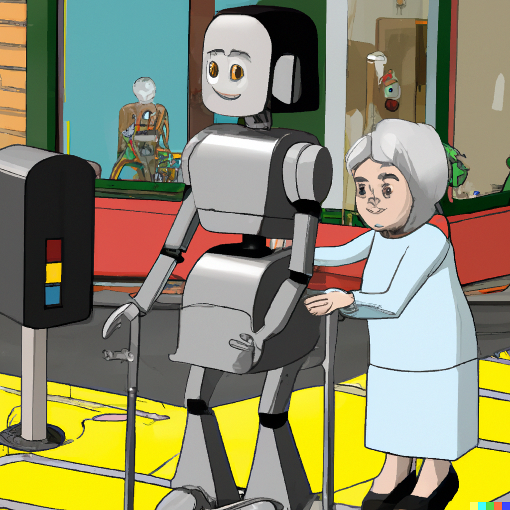
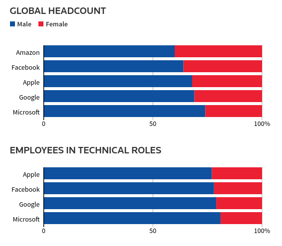
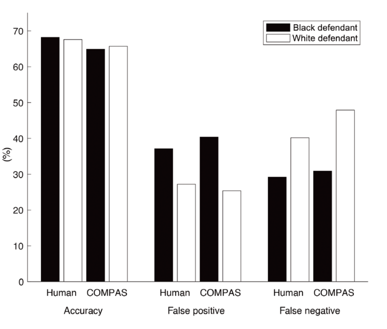

<!-- _class: lead -->

# Trustworthy AI:   Fairness, Interpretability   and Privacy 

## Lecture 3 - Fairness in Classification

 Image generated by OpenAI dall-e
 *Prompt:* "a trustworthy robot helping an old lady cross a busy street, realistic"

 

---

## Outline

* Recap: success stories in AI, what is classification, the measurement problem
* Can unawareness be the solution?
* Grounding our intuition of fairness/discrimination/bias in philosophy
* Grounding our intuition of fairness/discrimination/bias in computer science: Friedman and Nisselbaum
* Back to the ML loop: chances for amplification of discrimination
* Fairness definitions - starting from unawareness and why it does not work
* A few words about causality
* Fairness interventions: data level, model level, decision level

---

## Outline

* equality of opportunity and equality of outcome
* fairness by unawareness: procedural justice

---

## Outline

* compounding unfairness: the poverty loop and ML (see O'Neil in stoyanovich slides)
* parity-based fairness metrics
* why I did not just give the metrics?
* fairness interventions - the data is what it is. the world is what it is. 
* however, interventions are a "all is lost!" approach 
* data level, model level, decision level

---

## A few ML success stories

 

 

A "beauty pageant algorithm"

---

## A few ML success stories

 

 

Guardian, mostly white winners in the AI Beauty Pageant

---

## A few ML success stories 

Reuters: Amazon scraps secret AI recruiting tool that showed bias against women

---

## A few ML success stories 

>“Everyone wanted this holy grail,” one of the people said. “They literally wanted it to be an engine where I’m going to give you 100 resumes, it will spit out the top five, and we’ll hire those.”

---

## A few ML success stories 

>[...] Amazon’s computer models were trained to vet applicants by observing patterns in resumes submitted to the company over a 10-year period. Most came from men, a reflection of male dominance across the tech industry.

---

## A few ML success stories 

>[...] It penalized resumes that included the word “women’s,” as in “women’s chess club captain.” And it downgraded graduates of two all-women’s colleges, according to people familiar with the matter. 

---

## COMPAS

---

## COMPAS

---

## COMPAS

---

## How does this happen

Models/AI systems will always make **mistakes**, but the **distribution of those mistakes** may be affecting different groups of people in a disparate way 

 

As a perfect model is usually not available, the study of **fairness** in machine learning seeks to avoid situations in which certain groups are discriminated against

---

## Classification - A Primer

$X$: **data**, covariates
$Y$: ground truth, labels, **target variable**

Classification is the process of determining a plausible value for $Y$ given $X$.

More technically, one seeks to learn the parameters $\theta$ of some function $f_{\theta}$ which maps the **random variable** $X$ to an estimate $\hat{Y}$ of $Y$:

 

$$\hat{Y} = f_{\theta}(X)$$

---

## Classification - A Primer

$X$: qualification score
$Y$: the person received a positive evaluation from their manager after 12 months of employment (+) or not (-) 

---

## The ML loop

 
 

 

**Measurement**: the process in which the state of the world is reduced to data tables. 

---

## Measurement

 
 

>The “pro-male evaluation bias”, as some call it, generally leads women being rated lower in performance than men, even in situations where their performance has been demonstrably equal to the men’s. One study of the quality of writing in essays (researchers “varying” the sex of the author) showed similar bias, with both male and female readers rating the essays as being of lower quality if they believed the author was female.

Snipes, Thomson and Oswald. *Gender bias in customer evaluations of service quality*. Journal of Services Marketing, 2006. 

---

## Discrimination?

So far, we have relied on an intuitive understanding of the ideas of **discrimination** and **bias**, mostly by looking at case studies.

While it is challenging to come up with an all-encompassing definition of discrimination, I will give a very short summary of what political philosophers, social scientists and lawmakers have been saying about this matter.

Covering this topic during a CS lecture is challenging for both you and me!

This will **not** be comprehensive in any shape or form.

---

## Discrimination

Sources for this lecture:

* Reuben Binns. "Fairness in Machine Learning: Lessons from Political Philosophy". Proceedings of Machine Learning Research. 2018.
* Lippert-Ramussen. "Born Free and Equal?". Oxford University Press. 2014.
* European Court of Human Rights. "Handbook on European Non-Discrimination Law". 2010.

---

## Discrimination?

A few relevant questions:

* What is discrimination, exactly?
* What makes it wrong?
* Is "algorithmic discrimination" any different from human-produced discrimination?

---

## What is discrimination?

Direct discrimination is the practice of **treating differently** people on the basis of membership of a salient social group.

Examples:

* Preferring to hire a male applicant over an equally-qualified female applicant
* Imposing stricter conditions for parole on applicants belonging to a minority group

In the EU, this is covered by Article 21 of the Charter of Fundamental Rights.

In the US and in the ML fairness literature, this concept is usually referred to as disparate treatment.

---

## Indirect discrimination

Indirect discrimination is the practice of offering **the same treatment** to people in **different salient social groups** if this leads to one group of people **being put at a particular disadvantage**. 

In the US and in the ML fairness literature, this concept is usually called disparate impact.

Examples (EU Handbook on Anti-Discrimination Law):

* *Hilde Schönheit v. Stadt Frankfurt am Main*. The pensions of part-time employees were calculated using a different rate to that of full-time employees. This different rate was not based on the differences of the time spent in work. Thus, part-time employees received a smaller pension than full-time employees, even taking into account the different lengths of service, effectively meaning that part-time workers were being paid less. This neutral rule on the calculation of pensions applied equally to all part-time workers. However, because around 88% of part-time workers were women, **the effect of the rule was disproportionately negative for women as compared to men**.

---

## Indirect discrimination

Examples:

* *D.H. and Others v. the Czech Republic*. A series of tests were used to establish the intelligence and suitability of pupils in order to determine whether they should be moved out of mainstream education and into special schools. These special schools were designed for those with intellectual disabilities and other sources of learning difficulty. The same test was applied to all pupils who were considered for placement in special schools. However, in practice the test had been designed around the mainstream Czech population with the consequence that Roma students were inherently more likely to perform badly – which they did, **with the consequence that between 50% and 90% of Roma children were educated outside the mainstream education system**.

---

## Indirect discrimination?

At some level, we could disagree that the cases above constitute discrimination - and some certainly will disagree.

One possible argument: nobody **intended** any harm on certain groups, and the tests/pension rates were not computed with these issues in mind. 

Thus, no discrimination actually happened.

---

## What makes discrimination wrong?

In moral and political philosophy, the existance of **systematic animosity** for or against certain salient social groups on the part of the decision maker has traditionally been the ground for defining discrimination as wrong.

If the decision-maker also has an explicitly negative intent or a lack of respect towards an individual, then the decision maker is engaging in **discrimination**. 

Thus, one possible ground which we may analyze is **intent**.

---

## Intent and Discrimination

If the possession of certain "hostile" mental states is necessary to the definition of discrimination, then the case studies we have seen so far **do not constitute discrimination**.

Of course, algorithms possess no mental states.

The data scientists behind the AI systems may easily claim that they possessed no ill intent towards certain groups.

We also notice one central issue: the mental states account **does not cover indirect discrimination** necessarily.

---

## Individuals and Discrimination

Another possible ground: relying on inferences about individuals which are **based on generalizations** about the groups of which they are a member of. 

In other words: **failing to treat people as individuals**.

Assume that an employer reads that smokers are on average less productive than non-smokers. Then, job applicants who smoke are rejected without fail.

---

## Individuals and Discrimination

Here, we run into several problems:

* The definition of **generalization**. Assume that the same employer instead uses a long productivity test to decide whether an applicant should be hired. This is still generalization, but the course of action now seems less discriminatory.
* Is the point about **insufficiently precise** means of generalization? This seems unsatisfactory. How precise should they be, exactly?
* Is **algorithmic decision-making** ever admissible, under these conditions? A machine learning system usually performs **induction**, which is in itself a form of **generalization** (arguably).

---

## Egalitarianism

Another proposal is to look at our issues with the algorithms presented so far under the lens of egalitarianism.

Broadly: egalitarianism is the idea that people should be treated equally and that - sometimes - certain valuable things should be equally distributed. 

Therefore, we may say that the systems we have observed so far **do not follow egalitarianism**, broadly. 

---

## Egalitarianism

Rawls' thought experiment, the veil of ignorance

---

## Equality of what?

Not all egalitarian positions agree on **what** should be equally distributed. 

Competing views: pleasure or preference-satisfaction (Cohen), resources such as income and assets (Rawls and Dworkin), the ability and resources necessary to do certain things (Sen).

Algorithms which fail to equally distribute these may be inflicting **harms** to people in a disparate way depending on which group they belong to.

---

## Harms

A discriminatory (non-egalitarian) algorithm may inflict two different kind of harms:

* **Allocative**. Certain groups are denied resources in a disparate way. Examples: COMPAS, Amazon hiring system.
* **Representational**. The AI system reinforces the subordination of some groups. Example: beauty.ai, automatic translation

---

## Luck and desert

One facet which we have not discussed so far is **desert**, i.e. the condition of being deserving of some resource due to choices, talent, hard work, etc..

The (luck) egalitarian position is that inequalities which are due to **luck** - circumstances out of our control - should be corrected. 

Of course, tracing a line between which features in a feature vector are due to pure luck and which are also due to an individual's **choices** is far from simple.

**Measuring** luck and desert may also be extremely difficult and costly.

---

## Equality of opportunity

TODO: chapter 4 of mlbook, broad and narrow view

---

## Egalitarianism and Indirect Discrimination

Nonetheless, one could argue that egalitarianism provides a reasonable grounding for the wrongness of **both** direct and indirect discrimination.

---

## Discrimination?

A few relevant questions:

* What is discrimination, exactly?
* What makes it wrong?
* **Is "algorithmic discrimination" any different from human-produced discrimination?**

Please discuss!

---

## Fairness by unawareness

go back to devil's advocate and say: the issue is that we are talking about this at all. if we were colorblind, nothing like this would happen. let's just remove names, gender, etc. from CVs and we will be done. 

---

## Compounding discrimination

argue that algorithms may automatically compound discrimination

---

## Statistical non-discrimination criteria

When dealing with a classification algorithm, we may be interested in **quantifying** the unbalance in its decisions **across different groups**. 

Our setup is similar to what we discussed in the last lecture:

$X$ covariates; $Y$ target variable; $\hat{Y}$ our estimation of the target via the classifier $f_{\theta}$; the risk score $R$.

We add: $A$ the sensitive attribute, a discrete feature representing the group an individual belongs to. Examples: 1 man, 0 woman; 2 asian, 1 black, 0 white...

---

## Statistical non-discrimination criteria

 

We may be interested in balancing the **acceptance rate** of our classifier, i.e. $P(\hat{Y} = 1)$.

---

## Statistical non-discrimination criteria

 

Note that here we are assuming that one particular value of $Y$ - and therefore of $\hat{Y}$ represents a more desirable outcome - getting an interview, getting a loan, being released on parole...

---

## Independence

The random variables $(A, \hat{Y})$ satisfy independence if $\hat{Y} \bot A$. 

If $\hat{Y}$ is binary, then independence simplifies to the following condition:

 

$$\mathbb{P}(\hat{Y} = 1 \mid A = a) = \mathbb{P}(\hat{Y} = 1 \mid A = b)$$

If $A$ may take onto more values than $\{a, b\}$, then the condition must be satisfied for all group pairs, e.g. $(a, b), (a, c), (b, c)$.

---

## Independence

We may also relax independence as follows:

 

$$\mathbb{P}(\hat{Y}=1 \mid A = a) \geq \mathbb{P}(\hat{Y}=1 \mid A = b) - \epsilon$$

Or rewrite it as a ratio:

$$\frac{\mathbb{P}(\hat{Y}=1 \mid A = a)}{\mathbb{P}(\hat{Y}=1 \mid A = b)} \geq 1 - \epsilon$$

Where in both cases $\epsilon \geq 0$. 

---

## Independence

* Independence may reflect the belief that **all groups have an equal claim to acceptance**. 
* It has been investigated rather deeply in the ML literature.
* Note that independence does not require taking $Y$ into account at all. This may be OK if you believe you have systematic measurement bias in your $Y$ - for example, in hiring applications. 

---

## Independence

There is a bigger issue with independence - imagine a ill-intentioned decision maker which hires people from group $a$ with a rigorous process and some probability $p > 0$. 

People from group $b$ are hired randomly at the same rate $p$. 

This methodology perfectly satisfies independence. However, consider the ML loop...

---

## Independence

 

 

Actions have consequences on the state of the world and therefore on the data -- if the company starts a data-based hiring process after gathering this kind of data, it will see that employees of group $b$ are performing badly. 

---

## Separation

separation can also codify merit in some sense

---

## Outline

---

## Outline

---

## Outline

---

## Outline

---

## Outline

---

## Outline

---

## Outline

---

## Outline

---

## Outline

---

## Outline

---

## Outline

---

## Outline

---

## Outline

---

## Outline

---

## Outline

---

## Outline

---

## Outline

---

## Outline

---

## Outline

---

## Outline

---

## Outline

---

## Outline

---

## Outline

---

## Outline

---

## Outline

---

## Outline

---

## Outline

---

## Outline

---

## Outline

---

## Outline

---

## Outline

---

## Outline

---

## Outline

---

## Outline

---

## Outline

---

## Outline

---

## Outline

---

## Outline

---

## Outline

---

## Outline

---

## Outline

---

## Outline

---

## Outline

---

## Outline

---

## Outline

---

## Outline

---

## Outline

---

## Outline

---

## Outline

---

## Outline

---

## Outline

---

## Outline

---
