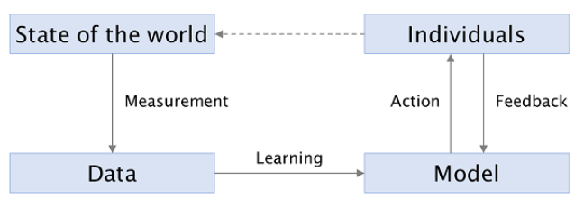

<!-- _class: lead -->

# Trustworthy AI:   Fairness, Interpretability   and Privacy 

## Lecture 4 - Preprocessing Methods in Fairness

 Image generated by OpenAI dall-e
 *Prompt:* "a trustworthy robot helping an old lady cross a busy street, realistic"

 

---

## What is discrimination?

Direct discrimination is the practice of **treating differently** people on the basis of membership to a salient social group.

Examples:

* Preferring to hire a male applicant over an equally-qualified female applicant
* Imposing stricter conditions for parole on applicants belonging to a minority group

In the EU, this is covered by Article 21 of the Charter of Fundamental Rights.

In the US and in the ML fairness literature, this concept is usually referred to as disparate treatment. 

---

## Indirect discrimination

Indirect discrimination is the practice of offering **the same treatment** to people in **different salient social groups** if this leads to one group of people **being put at a particular disadvantage**. 

In the US and in the ML fairness literature, this concept is usually called disparate impact.

---

## What makes discrimination wrong?

* **Mental states**: systematic animosity towards certain groups
 
* **Not treating people as individuals**: generalizing from stereotypes/statistics 
 
* **Non-egalitarianism**: the belief that people should have the same access to resources is not held

---

## Harms

A discriminatory (non-egalitarian) algorithm may inflict two different kind of harms:

* **Allocative**. Certain groups are denied resources in a disparate way. Examples: COMPAS, Amazon hiring system.
* **Representational**. The AI system reinforces the subordination of some groups. Example: beauty.ai, automatic translation

---

## Independence

The random variables $(A, \hat{Y})$ satisfy independence if $\hat{Y} \bot A$. 

If $\hat{Y}$ is binary, then independence simplifies to the following condition:

 

$$\mathbb{P}(\hat{Y} = 1 \mid A = a) = \mathbb{P}(\hat{Y} = 1 \mid A = b)$$

If $A$ may take onto more values than $\{a, b\}$, then the condition must be satisfied for all group pairs, e.g. $(a, b), (a, c), (b, c)$.

---

## Independence

We may also relax independence as follows:

 

$$\mathbb{P}(\hat{Y}=1 \mid A = a) \geq \mathbb{P}(\hat{Y}=1 \mid A = b) - \epsilon$$

Or rewrite it as a ratio:

$$\frac{\mathbb{P}(\hat{Y}=1 \mid A = a)}{\mathbb{P}(\hat{Y}=1 \mid A = b)} \geq 1 - \epsilon$$

Where in both cases $\epsilon \geq 0$. 

---

## Independence

* Independence may reflect the belief that **all groups have an equal claim to acceptance**. 
* It has been investigated rather deeply in the ML literature.
* Note that independence does not require taking $Y$ into account at all. This may be OK if you believe you have systematic measurement bias in your $Y$ - for example, in hiring applications. 

---

## Independence

There is a bigger issue with independence - imagine a ill-intentioned decision maker which hires people from group $a$ with a rigorous process and some probability $p > 0$. 

People from group $b$ are hired randomly at the same rate $p$. 

This methodology perfectly satisfies independence. However, consider the ML loop...

---

## Independence

 

 

Actions have consequences on the state of the world and therefore on the data -- if the company starts a data-based hiring process after gathering this kind of data, it will see that employees of group $b$ are performing badly. 

---

## Independence

>Using a dataset of all CEO transitions in Fortune 500 companies over a 15-year period, we analyze mechanisms that shape the promotion probabilities and leadership tenure of women and racial/ethnic minority CEOs. Consistent with the theory of the glass cliff, we find that **occupational minorities**—defined as white women and men and women of color—**are more likely than white men to be promoted CEO of weakly performing firms**. Though we find no significant differences in tenure length between occupational minorities and white men, we find that when firm performance declines during the tenure of occupational minority CEOs, these leaders are likely to be replaced by white men. We term this phenomenon the “savior effect.”

Cook and Glass. "*Above the glass ceiling: When are women and racial/ethnic minorities promoted to CEO?*". Strategic Management Journal 35, 2014.

---

## Separation

As previously discussed, independence does not consider $Y$ at all.

Nonetheless, if we believe that our ground truth $Y$ was collected carefully and does not contain much bias, it may represent a **partitioning of the population** into groups of **equal claim to acceptance**.

Of course some demographic group $A = a$ may be less well-represented in the label group $Y = 1$. One could argue that in these cases it is justified to accept fewer individuals from group $a$.  

---

## Separation

Random variables $(\hat{Y}, A, Y)$ satisfy **separation** if $\hat{Y} \bot A \mid Y$.

In the binary classification and binary $A$ case:

$$
\mathbb{P}(\hat{Y} = 1 \mid Y = 1, A = a) = \mathbb{P}(\hat{Y} = 1 \mid Y = 1, A = b)
\mathbb{P}(\hat{Y} = 1 \mid Y = 0, A = a) = \mathbb{P}(\hat{Y} = 1 \mid Y = 0, A = b)
$$

**Intuitively**: once we pick a value for $Y$, the value of $A$ does not matter for the classifier.

---

## Separation

$$
\mathbb{P}(\hat{Y} = 1 \mid Y = 1, A = a) = \mathbb{P}(\hat{Y} = 1 \mid Y = 1, A = b) \\
\mathbb{P}(\hat{Y} = 1 \mid Y = 0, A = a) = \mathbb{P}(\hat{Y} = 1 \mid Y = 0, A = b)
$$

 

Notice that $\mathbb{P}(\hat{Y} = 1 \mid Y = 1)$ is the **true positive rate**.

Remember that $1-$ true positive rate $=$ **false negative rate**.

Notice that $\mathbb{P}(\hat{Y} = 1 \mid Y = 0)$ is the **false positive rate**. 

Thus, separation requires that all groups experience **the same false negative rate** and **the same false positive rate**.

Separation may be understood as **error rate parity** across groups.

---

## Sufficiency

Random variables $(\hat{Y}, A, Y)$ satisfy **sufficiency** if $Y \bot A \mid \hat{Y}$.

In the binary classification and binary $A$ case:

$$
\mathbb{P}(Y = 1 \mid \hat{Y} = 1, A = a) = \mathbb{P}(Y = 1 \mid \hat{Y} = 1, A = b) \\
\mathbb{P}(Y = 1 \mid \hat{Y} = 0, A = a) = \mathbb{P}(Y = 1 \mid \hat{Y} = 0, A = b)
$$

**Intuitively**: parity of predicted positive/negative values across groups. 

---

## Incompatibility Theorems

These criteria constrain the joint distribution of $(Y, A, \hat{Y})$ in non-trivial ways. There are several **incompatibility theorems** that show us how these criteria cannot be satisfied simultaneously by any classifier $f$.

---

## Independence vs. Sufficiency

Independence: $A \bot \hat{Y}$.

Sufficiency: $Y \bot A \mid \hat{Y}$.

**Theorem 1**. Assume $A$ and $Y$ are not independent. Then, sufficiency and independence cannot both hold. 

**Proof** by contradiction. $A \bot \hat{Y}  \; \wedge \; A \bot Y \mid \hat{Y} \to A \bot (Y, A) \to A \bot Y$

---

## Independence vs. Separation.

Independence: $A \bot \hat{Y}$.

Separation: $\hat{Y} \bot A \mid Y$.

**Theorem 2**. Assume that $Y$ is binary, $A$ is not independent of $Y$ and $\hat{Y}$ is not independent of $Y$. Then, independence and separation cannot both hold.

---

## Independence vs. Separation

**Theorem 2**. Assume that $Y$ is binary, $A$ is not independent of $Y$ and $\hat{Y}$ is not independent of $Y$. Then, independence and separation cannot both hold.

**Proof.** By **contraposition**. Instead of proving $p \to q$, we prove $\neg q \to \neg p$. Therefore, we need to prove that 

$$A \bot Y \wedge A \bot \hat{Y} \mid Y \to A \bot Y \lor \hat{Y} \bot Y.$$

---

## Independence vs. Separation

By the law of total probability, 
$\mathbb{P}(\hat{Y} = \hat{y} \mid A = a) = \sum_y \mathbb{P}(\hat{Y} = \hat{y} \mid A = a, Y = y) \mathbb{P}(Y = y \mid A = a)$

Since we assume that $A \bot \hat{Y}$ and that $A \bot \hat{Y} \mid Y$, we may simplify the above to 

$\mathbb{P}(\hat{Y} = \hat{y}) = \sum_y \mathbb{P}(\hat{Y} = \hat{y} \mid Y = y) \mathbb{P}(Y = y \mid A = a)$

However, we can use total probability again to decompose $\mathbb{P}(\hat{Y} = \hat{y})$ as follows:

$\mathbb{P}(\hat{Y} = \hat{y}) = \sum_y \mathbb{P}(\hat{Y} = \hat{y} \mid Y = y) \mathbb{P}(Y = y)$

---

## Independence vs. Separation

 

It follows that the last two derivations must equal one another:

$\sum_y \mathbb{P}(\hat{Y} = \hat{y} \mid Y = y) \mathbb{P}(Y = y \mid A = a) = \sum_y \mathbb{P}(\hat{Y} = \hat{y} \mid Y = y) \mathbb{P}(Y = y)$

Let us rewrite this equation in a more compact way.

$p \coloneqq \mathbb{P}(Y = 0); \; p_a \coloneqq \mathbb{P}(Y = 0 \mid A = a); \; r_y = \mathbb{P}(\hat{Y} = \hat{y} \mid Y = y)$

Then,

$p r_0 + (1-p) r_1 = p_a r_0 + (1 - p_a) r_1$

---

## Independence vs. Separation

Then,

$p r_0 + (1-p) r_1 = p_a r_0 + (1 - p_a) r_1$

which we may rewrite as

$p(r_0 - r_1) = p_a(r_0 - r_1)$

This equation is satisfied only if $r_0 = r_1$, which implies $\hat{Y} \bot Y$; or if $p = p_a$ for all $a$, which implies $Y \bot A$.

---

## Separation vs. Sufficiency

Sufficiency: $Y \bot A \mid \hat{Y}$.

Separation: $\hat{Y} \bot A \mid Y$.

**Theorem 3**. Assume that all events in the joint distribution of $A, \hat{Y}, Y$ have non-zero probability. Also assume that $A \not \perp Y$. Then, separation and sufficiency cannot hold.

**Proof.** $A \bot \hat{Y} \mid Y \wedge A \bot Y \mid \hat{Y} \to A \bot (\hat{Y}, Y)$. Then, $A \bot \hat{Y} \wedge A \bot Y$.

---

## Fairness Interventions

If one is concerned about unbalanced/non-egalitarian decision making, one possible action is to employ **fairness interventions**

 

This is a catch-all term for various techniques which impact the level of independence, separation or sufficiency of a classifier - sometimes more than one at once.

 

As discussed previously, this is a **last resort approach** and no substitute to understand the data generation process.

---

## Fairness Interventions

Broadly, three classes of interventions:

* **Pre-processing**: changing the **data**, $X$ or $Y$ or both.
* **In-processing**: changing the **learning** process $f_{\theta}$.
* **Post-processing**: changing the **actions** $\hat{Y}$.

---

## Fairness Interventions

There is no current consensus on which class of intervention one should apply depending on the situation. However, it is possible to mention some strengths and weaknesses of each family of methods. 

**Pre-processing methods** are overall quite **interpretable**. After changing the data in some way, it is still possible to investigate and try to make sense of it.

On the other hand, it is hard to say if it will be **impossible to discriminate** after employing these techniques.

Furthermore, pre-processing entails **not having access to the decisions $\hat{Y}$**, which means they can be limited to indepdendence definitions.

---

## Fairness Interventions

 

**In-processing methods** are often more **accurate**, as one explores the tradeoff of fairness vs. accuracy during the training process itself. 

 

On the other hand they are **only as interpretable as the model** they are based on. 

---

## Fairness Interventions

 

Some **post-processing methods** are **optimal** in the sense that they achieve the best fairness-accuracy tradeoff under some assumptions.

 

However, they often **require to draw different thresholds for different groups**, which means that the sensitive attribute needs to be available at test time.

---

## Preprocessing methods

Preprocessing methods may be further divided into two families:

* **Data-level preprocessing**: modify $x$, $y$ or both. 
 
* **Representation-level preprocessing**: a new representation $\hat{x}$ of $x$ is found so that sensitive information $A$ is removed.

---

## Interventions Taxonomy (1)

---

## Interventions Taxonomy

Today: **suppression**, **massaging** and **reweighting**, as developed by Kamiran and Calders in *Data preprocessing techniques for classification without discrimination*, 2012. 

 

---

## Suppression

**Core idea**: finding those features in $X$ which correlate the most with the sensitive information $A$. 

Multiple measures of correlation between one feature $X_i$ and $S$ may be applicable here.

---

## Suppression

**Pearson correlation coefficient**: $\rho_{X_i, A} = \frac{cov(X_i, A)}{\sigma_{X_i} \sigma_{A}} = \frac{\mathbb{E}[(X_i - \mu_{X_i})(A - \mu_A)]}{\sigma_{X_i} \sigma_A}$

Also informally known as **linear correlation**. It is merely a normalization of the covariance between two random variables. 

* Easy to compute
* Possible to perform statistical testing for both zero and nonzero values
* Only considers **linear** correlation - more complex relationships may be missed. 

---

## Suppression

 

---

## Suppression

A more general alternative: the **mutual information** $I(X_i; A)$.

Originally developed by Claude Shannon and given its name by Roberto Fano, is a more general measure of correlation between two random variables. Its attractiveness is due to the fact that it is 0 **if and only if** two random variables are independent. 

It follows that one may also model independence as $I(\hat{Y}; A) = 0$ and separation as $I(\hat{Y}; A \mid Y) = 0$.

---

## Suppression

If $X_i$ and $A$ are discrete: $I(X_i; A) = \sum_{x_i \in X_i} \sum_{a \in A} \mathbb{P}(x_i, a) \; log( \frac{P(x_i, a)}{P(x_i)P(a))})$

 

In the continuous case, one can just substitute the sums with integrals. 

* General measure of correlation.
* **Hard to compute**. Estimating the joint probability $\mathbb{P}(x_i, a)$ can be extremely challenging. It is possible to simplify the computation somewhat via Bayes' theorem.

---

## Massaging

**Short summary**: changing the value of $y$ for some examples so to obtain independence or low values of the related metric.

**Assumptions**: a binary classification setting, binary sensitive attribute $A$, one privileged group $A=a$ and one underprivileged group $A=b$.

---

## Massaging

1. Train a ranker on the dataset $X, Y$ without taking into consideration $A$. A ranker is a function $r_{\theta}(x) \to [0, 1]$ which outputs the probability that $x$ is the most relevant (or most deserving) example. 
2. Create the **promotion list** by selecting all samples in which $A=b \wedge Y=0$ and rank them **descending** (from highest to lowest) with regard to the scores outputted by $r_{\theta}(x)$. 
3. Create the **demotion list** by selecting all samples in which $A=a \wedge Y=1$ and rank them **ascending** (from lowest to highest) with regard to the scores outputted by $r_{\theta}(x)$.
4. Select $m$ individuals from both lists. Change their label values.

---

## Massaging

* Quite an **intrusive** method, as it requires rewriting the data. 
 
* Different rankers $r_{\theta}$ will return different top-1 probabilities. This will in turn modify the **final result**.
 
* To be considered in the event that one is concerned about having a biased ground truth measurement process.
 

---

## Reweighting

Recall the definition of an optimal classifier: 

$$ argmin_{\theta} \; \mathbb{E}(\ell(Y, f_{\theta}(X))) $$

 

**Reweighting** creates a vector of weights $\mathbb{w} \in \mathbb{R}^+$ which length is equal to the number of elements in the training set. The optimal classifier is then re-defined as follows:

$$ argmin_{\theta} \; \mathbb{E}(\ell(Y, \mathbb{w} \, \cdot f_{\theta}(X))) $$

$$ = argmin_{\theta} \; \frac{1}{N} \sum_{i=1}^{N} \ell(y_i, \mathbb{w_i} \, \cdot f_{\theta}(x_i))) $$

 

Where $x_i$ is the $i$-th example in the training set and $N$ is the number of examples therein.

---

## Reweighting // Resampling

 

Note that not all learning algorithms are able to work with weighted examples. 

 

In that case, one can **resample** the dataset according to the distribution of $\mathbb{w}$. Roughly speaking, each example $x_i$ has a probability of $w_i$ to be included in the resampled dataset. 

---

## Reweighting

Each weight $w_i$ is assigned to one $x_i$ and is computed as a function of the label value and sensitive attribute value:

$$ \mathbb{w}(A, Y) = \frac{\mathbb{P}_{ind}(A = a_i \; \wedge Y = y_i)}{\mathbb{P}_{obs}(A = a_i \; \wedge Y = y_i)} $$

where $\mathbb{P}_{ind}$ is the probability in the **world where independence holds** and therefore  $A \bot Y$.

$$\mathbb{P}_{ind}(A = a_i \wedge Y = y_i) = \mathbb{P}(A = a_i) \cdot \mathbb{P}(Y = y_i)$$

and where $\mathbb{P}_{obs}$ is obtained from the dataset by counting.

---

## Reweighting

Let's work through an example. 

| Sex 	| Ethnicity  	| Degree      	| Job Type   	| $Y$ 	|
|-----	|------------	|-------------	|------------	|-------	|
| M   	| Native     	| High School 	| Board      	| 1     	|
| M   	| Native     	| University  	| Board      	| 1     	|
| M   	| Native     	| High School 	| Board      	| 1     	|
| M   	| Non-Native 	| High School 	| Healthcare 	| 1     	|
| M   	| Non-Native 	| University  	| Healthcare 	| 0     	|
| F   	| Non-Native 	| University  	| Education  	| 0     	|
| F   	| Native     	| High School 	| Education   	| 0     	|
| F   	| Native     	| None        	| Healthcare 	| 1     	|
| F   	| Non-native 	| University  	| Education  	| 0     	|
| F   	| Native     	| High School 	| Board      	| 1     	|

---

## Reweighting

We first note that $1/2$ of the examples have $A = ``F"$ and that $6/10$ examples have $Y = 1$.

If independence was held, we would have that $\mathbb{P}(A = ``F'' \wedge Y = 1) = 1/2 * 6/10 = 3/10$. **This is $\mathbb{P}_{ind}$**.

Instead, we see that in the dataset this probability is $2/10$. **This is $\mathbb{P}_{obs}$**.

Thus, we compute $\mathbb{w}$ for all examples in which $A = ``F''$ and $Y = 1$ as follows:

$$w(A = ``F'' \wedge Y = 1) = \frac{0.5 \cdot 0.6}{0.2} = 1.5$$

---

## Reweighting

* Rather flexible - if the classifier cannot use $w$, just resample.
 
* Doesn't particularly take the idea of **merit** into account at all. Some extensions do that via ranking probabilities, similarly to massaging. These are also discussed in Kamiran and Calders, 2012. 
 
* Easy to design extensions in which we also care about other probabilities, e.g. a minimum level of degree, and compute the weights also according to that. 
 
* Notice that all the methodologies presented today do not require $A$ at inference time. This lets the learned classifier $f_{\theta}(x)$ be "independent" of $A$. Nonetheless, the intervention was "encoded" in $w$ (reweighting), $Y$ (massaging) or $X$ (suppression)

---

## Next Lecture

* In-processing: deriving a loss function for fairness
 
* Representation-level pre-processing: learning fair representations

---

<!-- _class: lead -->

# Trustworthy AI:   Fairness, Interpretability   and Privacy 

## Thanks!

 Image generated by OpenAI dall-e
 *Prompt:* "a trustworthy robot helping an old lady cross a busy street, realistic"

 

