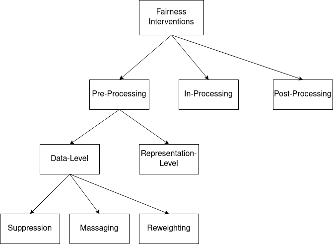

<!-- _class: lead -->

# Trustworthy AI:   Fairness, Interpretability   and Privacy 

## Lecture 5: In-Processing Methods in Fairness

 Image generated by OpenAI dall-e
 *Prompt:* "a trustworthy robot helping an old lady cross a busy street, realistic"

 

---

## Incompatibility Theorems

 

Fairness independence criteria constrain the joint distribution of $(Y, A, \hat{Y})$ in non-trivial ways. There are several **incompatibility theorems** that show us how these criteria cannot be satisfied simultaneously by any classifier $f$.

---

## Fairness Interventions

If one is concerned about unbalanced/non-egalitarian decision making, one possible action is to employ **fairness interventions**

 

This is a catch-all term for various techniques which impact the level of independence, separation or sufficiency of a classifier - sometimes more than one at once.

 

As discussed previously, this is a **last resort approach** and no substitute to understand the data generation process.

---

## Fairness Interventions

Broadly, three classes of interventions:

* **Pre-processing**: changing the **data**, $X$ or $Y$ or both.
* **In-processing**: changing the **learning** process $f_{\theta}$.
* **Post-processing**: changing the **actions** $\hat{Y}$.

---

## Interventions Taxonomy (1)

---

## Interventions Taxonomy

Today: **suppression**, **massaging** and **reweighting**, as developed by Kamiran and Calders in *Data preprocessing techniques for classification without discrimination*, 2012. 

 

---

## Suppression

**Core idea**: finding those features in $X$ which correlate the most with the sensitive information $A$. 

Multiple measures of correlation between one feature $X_i$ and $S$ may be applicable here.

---

## Suppression

**Pearson correlation coefficient**: $\rho_{X_i, A} = \frac{cov(X_i, A)}{\sigma_{X_i} \sigma_{A}} = \frac{\mathbb{E}[(X_i - \mu_{X_i})(A - \mu_A)]}{\sigma_{X_i} \sigma_A}$

Also informally known as **linear correlation**. It is merely a normalization of the covariance between two random variables. 

* Easy to compute
* Possible to perform statistical testing for both zero and nonzero values
* Only considers **linear** correlation - more complex relationships may be missed. 

---

## Suppression

 

---

## Suppression

A more general alternative: the **mutual information** $I(X_i; A)$.

Originally developed by Claude Shannon and given its name by Roberto Fano, is a more general measure of correlation between two random variables. Its attractiveness is due to the fact that it is 0 **if and only if** two random variables are independent. 

It follows that one may also model independence as $I(\hat{Y}; A) = 0$ and separation as $I(\hat{Y}; A \mid Y) = 0$.

---

## Suppression

If $X_i$ and $A$ are discrete: $I(X_i; A) = \sum_{x_i \in X_i} \sum_{a \in A} \mathbb{P}(x_i, a) \; log( \frac{P(x_i, a)}{P(x_i)P(a))})$

 

In the continuous case, one can just substitute the sums with integrals. 

* General measure of correlation.
* **Hard to compute**. Estimating the joint probability $\mathbb{P}(x_i, a)$ can be extremely challenging. It is possible to simplify the computation somewhat via Bayes' theorem.

---

## Massaging

**Short summary**: changing the value of $y$ for some examples so to obtain independence or low values of the related metric.

**Assumptions**: a binary classification setting, binary sensitive attribute $A$, one privileged group $A=a$ and one underprivileged group $A=b$.

---

## Massaging

1. Train a ranker on the dataset $X, Y$ without taking into consideration $A$. A ranker is a function $r_{\theta}(x) \to [0, 1]$ which outputs the probability that $x$ is the most relevant (or most deserving) example. 
2. Create the **promotion list** by selecting all samples in which $A=b \wedge Y=0$ and rank them **descending** (from highest to lowest) with regard to the scores outputted by $r_{\theta}(x)$. 
3. Create the **demotion list** by selecting all samples in which $A=a \wedge Y=1$ and rank them **ascending** (from lowest to highest) with regard to the scores outputted by $r_{\theta}(x)$.
4. Select $m$ individuals from both lists. Change their label values.

---

## Massaging

* Quite an **intrusive** method, as it requires rewriting the data. 
 
* Different rankers $r_{\theta}$ will return different top-1 probabilities. This will in turn modify the **final result**.
 
* To be considered in the event that one is concerned about having a biased ground truth measurement process.
 

---

## Reweighting

Recall the definition of an optimal classifier: 

$$ argmin_{\theta} \; \mathbb{E}(\ell(Y, f_{\theta}(X))) $$

 

**Reweighting** creates a vector of weights $\mathbb{w} \in \mathbb{R}^+$ which length is equal to the number of elements in the training set. The optimal classifier is then re-defined as follows:

$$ argmin_{\theta} \; \mathbb{E}(\ell(Y, \mathbb{w} \, \cdot f_{\theta}(X))) $$

$$ = argmin_{\theta} \; \frac{1}{N} \sum_{i=1}^{N} \ell(y_i, \mathbb{w_i} \, \cdot f_{\theta}(x_i))) $$

 

Where $x_i$ is the $i$-th example in the training set and $N$ is the number of examples therein.

---

## Reweighting // Resampling

 

Note that not all learning algorithms are able to work with weighted examples. 

 

In that case, one can **resample** the dataset according to the distribution of $\mathbb{w}$. Roughly speaking, each example $x_i$ has a probability of $w_i$ to be included in the resampled dataset. 

---

## Reweighting

Each weight $w_i$ is assigned to one $x_i$ and is computed as a function of the label value and sensitive attribute value:

$$ \mathbb{w}(A, Y) = \frac{\mathbb{P}_{ind}(A = a_i \; \wedge Y = y_i)}{\mathbb{P}_{obs}(A = a_i \; \wedge Y = y_i)} $$

where $\mathbb{P}_{ind}$ is the probability in the **world where independence holds** and therefore  $A \bot Y$.

$$\mathbb{P}_{ind}(A = a_i \wedge Y = y_i) = \mathbb{P}(A = a_i) \cdot \mathbb{P}(Y = y_i)$$

and where $\mathbb{P}_{obs}$ is obtained from the dataset by counting.

---

## Reweighting

Let's work through an example. 

| Sex 	| Ethnicity  	| Degree      	| Job Type   	| $Y$ 	|
|-----	|------------	|-------------	|------------	|-------	|
| M   	| Native     	| High School 	| Board      	| 1     	|
| M   	| Native     	| University  	| Board      	| 1     	|
| M   	| Native     	| High School 	| Board      	| 1     	|
| M   	| Non-Native 	| High School 	| Healthcare 	| 1     	|
| M   	| Non-Native 	| University  	| Healthcare 	| 0     	|
| F   	| Non-Native 	| University  	| Education  	| 0     	|
| F   	| Native     	| High School 	| Education   	| 0     	|
| F   	| Native     	| None        	| Healthcare 	| 1     	|
| F   	| Non-native 	| University  	| Education  	| 0     	|
| F   	| Native     	| High School 	| Board      	| 1     	|

---

## Reweighting

We first note that $1/2$ of the examples have $A = ``F"$ and that $6/10$ examples have $Y = 1$.

If independence was held, we would have that $\mathbb{P}(A = ``F'' \wedge Y = 1) = 1/2 * 6/10 = 3/10$. **This is $\mathbb{P}_{ind}$**.

Instead, we see that in the dataset this probability is $2/10$. **This is $\mathbb{P}_{obs}$**.

Thus, we compute $\mathbb{w}$ for all examples in which $A = ``F''$ and $Y = 1$ as follows:

$$w(A = ``F'' \wedge Y = 1) = \frac{0.5 \cdot 0.6}{0.2} = 1.5$$

---

## Reweighting

* Rather flexible - if the classifier cannot use $w$, just resample.
 
* Doesn't particularly take the idea of **merit** into account at all. Some extensions do that via ranking probabilities, similarly to massaging. These are also discussed in Kamiran and Calders, 2012. 
 
* Easy to design extensions in which we also care about other probabilities, e.g. a minimum level of degree, and compute the weights also according to that. 
 
* Notice that all the methodologies presented today do not require $A$ at inference time. This lets the learned classifier $f_{\theta}(x)$ be "independent" of $A$. Nonetheless, the intervention was "encoded" in $w$ (reweighting), $Y$ (massaging) or $X$ (suppression)

---

## Interventions Taxonomy

---

## Interventions Taxonomy

---

## In-Processing

**Regularization** approaches model fairness in the **objective function** of a classifier.

 

For this reason, they can often be more accurate than preprocessing methods.

 

As mentioned previously, however, they are only as interpretable as the model one is employing. 

 

Today: a "fair" logistic regression classifier

---

## In-Processing: Fair Regularizer

This contribution is due to Kamishima et al., *Fairness-Aware Classifier with Prejudice Remover Regularizer*, 2012.

---

## Regularization

Recall that our classifier $f_{\theta}$ may be **trained** to obtain the **optimal parameters** $\theta^*$:

$$ \theta^* = argmin_{\theta} \, \mathbb{E}(\ell(f_{\theta}(X), Y)) \\ = argmin_{\theta} \, \mathbb{E}(\ell(\hat{Y}, Y)) $$

For clarity of notation, let us redefine $f$ so that it also sees the sensitive data $A$ as input: 

$$ \theta^* = argmin_{\theta} \, \mathbb{E}(\ell(f_{\theta}(X, A), Y))$$

---

## Regularization

Once again: exactly how one can do this is beyond the scope of this lecture and depends on what $f$ is exactly. In the case of logistic regression, we have e.g. gradient descent.

 

Nonetheless, let us see a connection between the optimal classifier and the log-likelihood.

---

## Regularization

Let us establish that our classifier $f_{\theta}(X, A)$ **models** the conditional distribution:

$$ f_{\theta}(X, A) :- \; P(Y \mid X, A) $$

 

which we can informally read as "$f_{\theta}$ models/induces $P(Y \mid X, A)$". 

Notice also that we can factorize the joint $P(X, A, Y)$ as follows:

$$P(X, A, Y) = P(Y \mid X, A) P(X, A) \\ = f_{\theta}(X, A) P(X, A) $$

---

## Regularization

At this point, we introduce **regularization** in general: it is a technique to **reduce the variance** of our model $f_{\theta}$ by constraining the possible values of $\theta$.

 

It changes our optimization problem as follows:

$$ argmin_{\theta} \; \mathbb{E}(\ell(f_{\theta}(X, A), Y)) + \lambda \cdot \sum_{j=1}^{m} \theta_m^2 $$

where $\lambda \in \mathbb{R}^+$ is the **regularization strength** and $m$ is the number of parameters in $\theta$. High values of $\theta$ are **penalized**, and one needs to strike a compromise between minimal expected cost and low values for $\theta$. 

---

## Regularization

We can use a similar concept to introduce a mutual information term in our problem:

$$ argmin_{\theta} \; \mathbb{E}(\ell(f_{\theta}(X, A), Y)) + \sum_{j=1}^{m} \theta_m^2 + \eta \cdot I(\hat{Y}, A) $$

where $\eta \in \mathbb{R}^+$ is the "fair regularization strength".

---

## Regularization

Recall that 

$$ I(\hat{Y}, A) = P(\hat{Y}, A) \; log \; \frac{P(\hat{Y}, A)}{P(\hat{Y}) P(A)}$$ 

And that 

$$ P(\hat{Y}, A, X) = P(X, A) P(\hat{Y} \mid X, A) = \sum_{x \in X} P(x, A) P(\hat{Y} \mid x, A) $$

---

## Regularization

Then, one can rewrite the mutual information as:

$$ \sum_{i=1}^{n} \sum_{y \in \{0, 1\}} f_{\theta}(x_i, a_i) \; log \; \frac{P(y \mid a_i)}{P(y)} $$

Where the argument of the logarithm can be estimating by counting:

$$P(y \mid a) =  \frac{\sum_{x_i, a_i \; s.t. \, a_i = a} f_{\theta}(x_i, a_i)}{\mid \{x_i, a_i \} \; s.t. \, a_i = a \mid} $$

 

$$P(y) = \frac{\sum_{i=1}^n f_{\theta}(x_i, a_i)}{n} $$

---

## Fair Representations

Next lecture: **fair representation learning** and an introduction to neural networks. 

 

These techniques may be understood as learning the following classifier:

$$ 
argmin_{\theta} \; \mathbb{E}(\ell(f_{\theta}(X, A), Y)) + \sum_{j=1}^{m} \theta_m^2 + \eta \cdot I(\hat{X}, A)
$$

---

<!-- _class: lead -->

# Trustworthy AI:   Fairness, Interpretability   and Privacy 

## Thanks!

 Image generated by OpenAI dall-e
 *Prompt:* "a trustworthy robot helping an old lady cross a busy street, realistic"

 

