<!-- _class: lead -->

# Trustworthy AI:   Fairness, Interpretability   and Privacy 

## Lecture 6 - Fair Representations

 Image generated by OpenAI dall-e
 *Prompt:* "a trustworthy robot helping an old lady cross a busy street, realistic"

 

---

## Fairness Interventions

If one is concerned about unbalanced/non-egalitarian decision making, one possible action is to employ **fairness interventions**

 

This is a catch-all term for various techniques which impact the level of independence, separation or sufficiency of a classifier - sometimes more than one at once.

 

As discussed previously, this is a **last resort approach** and no substitute to understand the data generation process.

---

## Interventions Taxonomy

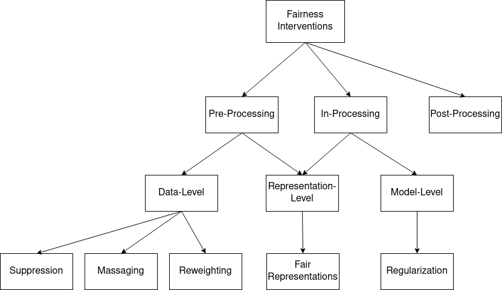

---

## In-Processing

**Regularization** approaches model fairness in the **objective function** of a classifier.

 

For this reason, they can often be more accurate than preprocessing methods.

 

As mentioned previously, however, they are only as interpretable as the model one is employing. 

---

## Neural Networks

 

Neural networks are now the de facto choice for many challenging ML tasks, particularly those who require **non-tabular-data** as input.

* Computer vision: images, video...
* Natural language processing: text
* Speech recognition: raw audio waveforms

---

## Neural networks: the neuron

 

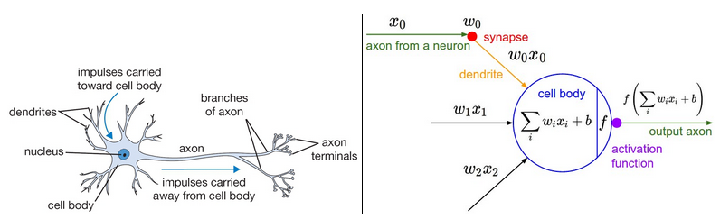

---

## Neural Networks: the neuron

Modelled by McCulloch and Pitts in 1943. "A logical calculus of the ideas immanent in nervous activity"

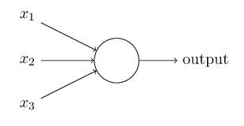

---

## Neural Networks: the neuron

Weights and activations are usually taken to be **real numbers**, while the activation function is originally a simple threshold:

$$ f(x) = 
\begin{cases} 
1 & \text{if } \sum_i w_i x_i + b \geq 0  \\
0 & \text{otherwise } 
\end{cases}$$

Note that in this notation $x_i$ is the $i$-th position of the vector $x$ and not the $i$-th example in the dataset. 

---

## Neural Networks: the neuron

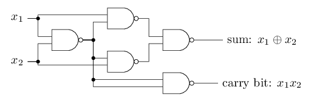

Original purpose of neural networks: represent logical functions.

---

## Neural Networks: the neuron

 

Original purpose of neural networks: represent logical functions.

 

Think back of the **clinical vs. actuarial AI** debate - at this point, the consensus was that human thought could be represented as logical inference. 

---

## Neural Networks: the neuron

Other choices of activation functions are possible. 

 

Sigmoid function: $f(x) = \frac{1}{e^{-w_i x_i + b} + 1} \in [0, 1]$. May be interpreted as a probability value for a Bernoulli distribution. Useful for binary classification.

 

Softmax function: $f(x) = \frac{e^{-w_i x_i + b}}{\sum_k e^{-w_i x_i + b}}$. The **layer** can then be interpreted as representing a multinomial distribution. Useful for multi-class classification.

---

## Neural Networks: the Perceptron

The **perceptron** is a simple neural architecture with $m$ input neurons and 1 output neuron connected to each other via a set of weights.

 

By following a simple update rule, it is also possible to **learn optimal weights** for classification. 

 

Roughly equivalent to logistic regression.

---

## Neural Networks: the Perceptron

 

Update rule:

$$
w_i(t+1) = w_i(t) + \eta \cdot (y - f(x_i)) \, x_i
$$

 

where $t$ is the current iteration of the update rule. Contrary to how we have been doing so far, here $y \in \{-1, +1\}$. $\eta \in (0, 1]$ is the learning rate, which controls how strong are our updates.  

 

---

## Neural Networks: the Perceptron

Implemented in hardware in the US, 1959.

---

## Neural Networks: Multi-layer perceptron

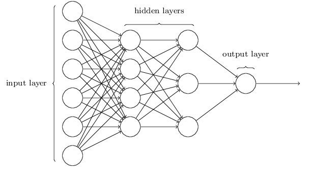

**Generalization** of the perceptron architecture to have multiple "hidden" layers of neurons between input and output.

---

## Neural Networks: Multi-layer perceptron

Rationale: **sigmoid-activated**, multi-layer perceptrons are **universal function approximators**, meaning (among other things) that they can learn **any classification function**. 

 

This result is due to Cybenko in 1989, "Approximation by superpositions of a sigmoidal function".

 

Note that this does not mean that they **will** learn it **every time**. Here one assumes infinite data, computation time... 

---

## Neural Networks: Multi-layer perceptron

The weights are learned via the backpropagation algorithm, which history is relatively contentious. 

 

It was popularized for neural networks in 1986 by Rumelhart, Hinton and Williams, "Learning representations by back-propagating errors". The general mathematical technique is due to Seppo Linnainmaa in 1970 and 1976. 

 

A complete description of backpropagation is beyond the scope of our class.

---

## Neural Networks: Multi-layer perceptron

A complete description of backpropagation is beyond the scope of our class.

 

**Core concept**: if your network makes a classification error $e$, assign some **responsability** to each parameter **w**. Then, update the **more** responsible parameters **more strongly**. 

 

---

## Neural Networks: Multi-layer perceptron

 

In very abstract terms, backpropagation is a **credit assignment** algorithm, where each parameter/weight gets some credit for the final decision $f(x)$. After computing the credit, one is able to use it for **gradient descent**.

 

**Gradient descent**: assuming one has access to a cost/loss function $L(f_\theta(X), Y)$, it is possible to minimize it by following **its gradient's direction** w.r.t. the parameters: $- \nabla_{\theta} L(f_{\theta}, Y)$.

However, **we do not have convergence guarantees** when using backprop.

---

## Neural Networks: Multi-layer perceptron

In practice, this means that our objective

 

$$

\theta^* = argmin_{\theta} = \mathbb{E}(f_{\theta}(X) - Y) = L(f_{\theta}, Y)

$$

 

is not **fully obtainable** when using MLPs and backprop. One is usually happy about a "good enough" $\theta^{*}$. The sub-optimal solution obtained with MLPs is often better than the optimal solution of e.g. linear classifiers.

---

## Neural Networks: Multi-layer perceptron

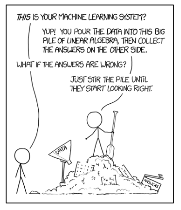

---

## Neural Networks: Convolutional Neural Nets

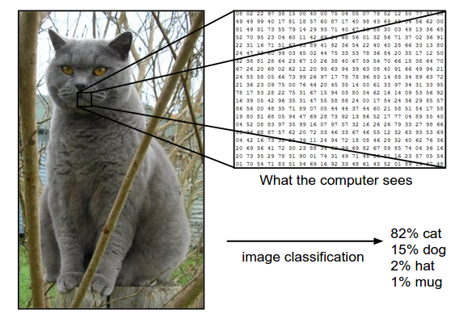

Challenge: making neural networks work for image classification.

---

## Neural Networks: Convolutional Neural Nets

Challenge: making neural networks work for images.

Assume we use a MLP and have a 500x500px image. We have two issues:

* **Number of input neurons**: 250k. If our second layer has (say) 100 neurons, we need 2.5M connections between them!
* **Loss of image structure**: a MLP is only able to "read in" vector-based data. Thus, we need to vectorize the image somehow. 

---

## Neural Networks: Convolutional Neural Nets

In image processing, the **convolution** operation is often employed to extract features or process the data in some way.

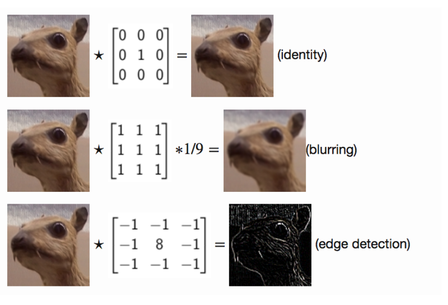

---

## Neural Networks: Convolutional Neural Nets

Enter the **convolutional layer**: by using weight sharing and sliding windows, one can implement a more sparse connectivity pattern which can also perform feature extraction. 

Our layer parameters are, in practice, convolution matrices.

---

## Neural Networks

<video controls="controls" width="90%" source="img/net.mp4">

---

## Neural Networks: Convolutional Neural Nets

A full "AlexNet" architecture:

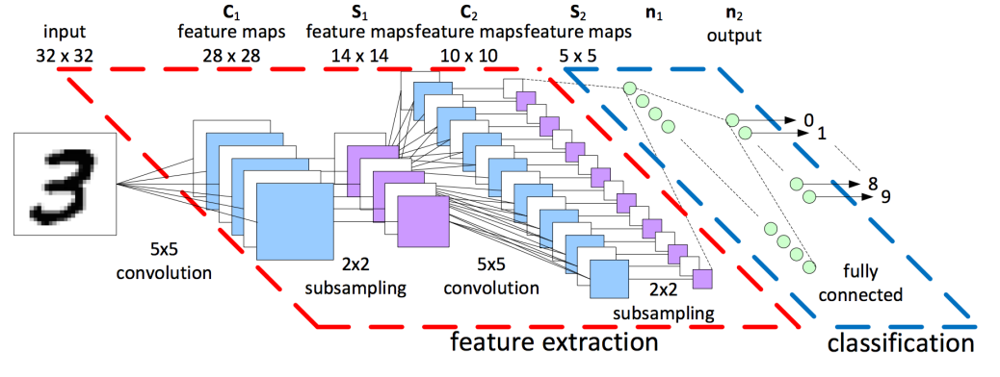

---

## Neural Networks: Convolutional Neural Nets

Convolutional nets are feature extractors: by looking at how certain layers activate, one sees what each filter is "looking at". 

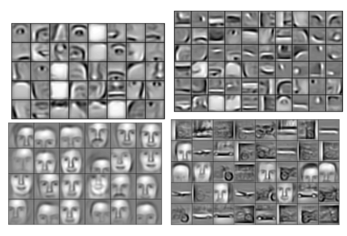

---

## Neural Networks: Convolutional Neural Nets

 

Does this mean that neural networks are **interpretable**?

 

Would you trust a neural network to make decisions on your loan request? Or on the COMPAS dataset?

---

## Neural Networks: Interpretability?

Compare neural nets with a linear classifier:

 

$$
f(x) = w_0 x_0 + \dots + w_m x_m
$$

 

Here, we have only a "single layer" which is completely responsible for our decisions. We can investigate it rather easily by looking at the weights. 

 

There is usually a closed-form solution to obtain a linear classifier. Neural network training is based on gradient descent without convergence guarantees. 

---

## Neural Networks: Fair Representations

While interpretation and explanation are the topics of the next few lectures, we will now look at the idea of **fair representations**. 

 

Core concept: while we do not fully understand neural nets, we can try to make sure that they **do not discriminate**. 

 

Since neural networks are feature extractors, we can try to encourage them to **unlearn correlations** w.r.t. $A$.

---

## Neural Networks: Adversarial Training

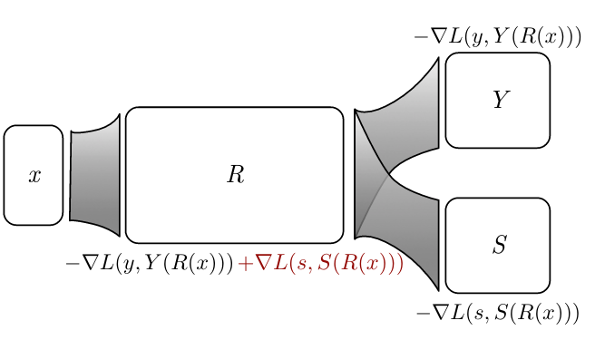

$R$: feature extractor network
$Y$: here, a classification network predicting labels.
$S$: here, a classification network predicting sensitive attributes.

---

## Neural Networks: Adversarial Training

Update $R$'s parameters so that:

* The classification cost/loss w.r.t. the labels is **minimized**;
* The classification cost/loss w.r.t. the sensitive attribute is **maximized**.

---

## Neural Networks: Adversarial Training

$$\theta^* = arg \; min_{\theta_R, \theta_Y} [ L (y, Y(R(X))) + \lambda \cdot max_{\theta_S} L(s, S(R(X)))]$$

---

## Neural Networks: Adversarial Training

Then, the features obtained $\hat{X} = R(X)$ will contain little to no information about $A$. 

 

One can test this by training a supervised classifier which tries to predict $A$ from $\hat{X}$.

 

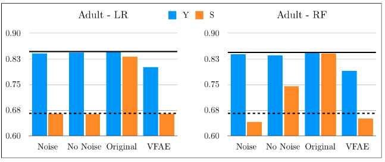

---

## Neural Networks: Mutual Information

While this work in practice, **its theoretical standing is unclear**.

 

No guarantee that the mutual information $I(\hat{X}; A)$ will be actually minimized. The optimization problem is quite complex and can run into many problems (instability, sub-optimality...)

 

---

## Neural Networks: Mutual Information

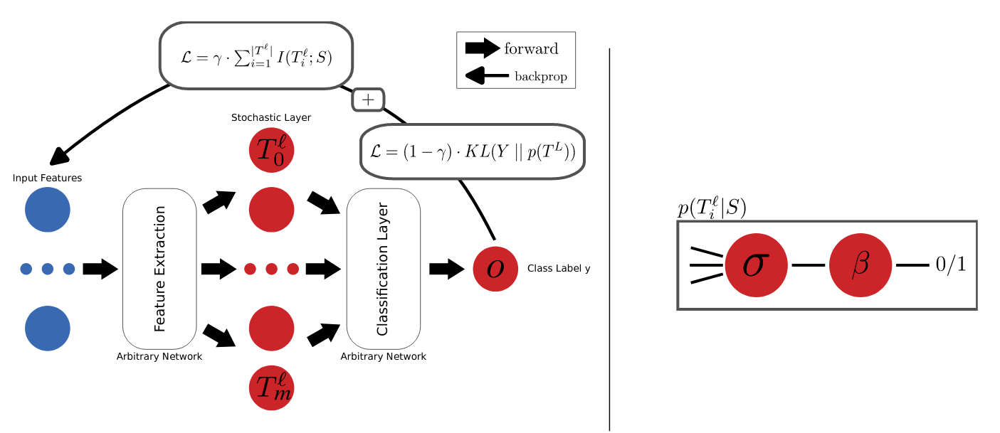

**A new trick**: use stochastic activations for the neurons at the layer in which $\hat{X}$ is computed. $f(X) = Bernoulli(f(X))$. This is computable as long as $f(X)$ is sigmoidally-activated.

---

## Neural Networks: Mutual Information

**A new trick**: use stochastic activations for the neurons at the layer in which $\hat{X}$ is computed. $f(X) = Bernoulli(f(X_i))$. This is computable as long as $f(X_i)$ is sigmoidally-activated.

Then, $\hat{X_i}$ actually follows a specific probability distribution. $I(\hat{X}_i; A)$ then is easily computable as long as $A$ is binary, which means that we can model it as $A \sim Bernoulli(p)$ where $p$ is computed from the dataset.

$$ I(\hat{X_i}; A) = H(\hat{X_i}) - H(\hat{X_i} | A)$$

And the entropy for Bernoulli random variables has a simple closed form. https://arxiv.org/pdf/2208.02656.pdf

---

## Image credits

Michael Nielsen; Stanford CS231n; 3blue1brown from youtube.

