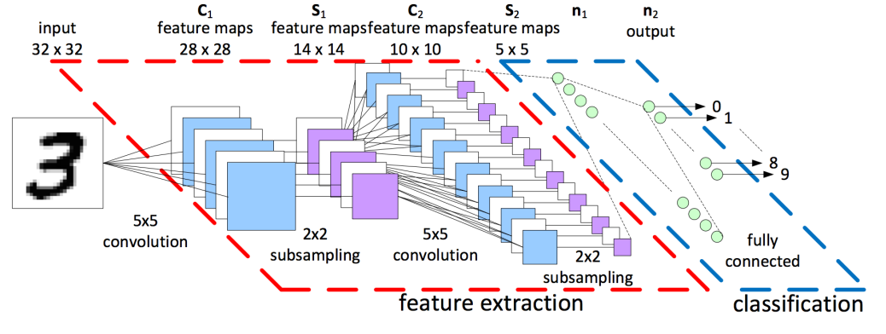

<!-- _class: lead -->

# Trustworthy AI

 

## Lecture 7 - Transparency & Explanations

 
 
 

 Image generated by OpenAI dall-e
 *Prompt:* "a robot looks within itself and sees a scary mass of data and mathematical formulas. comic style"

 

---

## Todos

1. more previous work

---

## Neural Networks: Multi-layer perceptron

**Generalization** of the perceptron architecture to have multiple "hidden" layers of neurons between input and output.

---

## Neural Networks: Convolutional Neural Nets

Each layers' parameters are organized into matrices which are then convolved with the previous layer's output. 

---

## Neural Networks: Parameter space

---

 
 

## **Deep neural networks are black boxes**.

* Why?
* What is lacking from our understanding?
* Are there clear desiderata they do not have?

---

## **Deep neural networks are ~~black boxes~~ statistically surprising**

Statistical learning theory (SLT) cannot explain their **generalization capabilities**. 

**Generalization** is the ability to transfer performance from a finite training set to a test set which is sampled from the same distribution. 

SLT proposes to describe various choices for $f$ based on their **complexity**. The lower the complexity, the better generalization guarantees we have. 

---

## Generalization in DNNs

Example SLT technique: **Rademacher complexity**

Given some hypothesis class $\mathcal{F}$ from which our $f$ is sampled, we can define the empirical Rademacher complexity of $\mathcal{F}$ as:

$$ \mathcal{\hat{R}}(\mathcal{F}) = \mathbb{E}_{\sigma} ( sup_{f \in F} \; \frac{1}{n} \sum_{i=1}^n \mathbb{I}[f(x_i) = \sigma_i y_i]) $$

where $\sigma_i$ are random variables $\in \{ -1, 1 \}$. 

---

## Generalization in DNNs

$$ \mathcal{\hat{R}}(\mathcal{F}) = \mathbb{E}_{\sigma} ( sup_{f \in F} \; \frac{1}{n} \sum_{i=1}^n \mathbb{I}[f(x_i) = \sigma_i y_i]) $$

In practice: take some number of $f$ in $\mathcal{F}$; the Rademacher complexity of $\mathcal{F}$ may be computed as the best performance of one $f$ on a **randomly labeled test set**.

One can then upper bound the expected generalization error of one $f \in \mathcal{F}$ with $\mathcal{\hat{R}}$, up to a constant.

---

## Generalization in DNNs

$$ \mathcal{\hat{R}}(\mathcal{F}) = \mathbb{E}_{\sigma} ( sup_{f \in F} \; \frac{1}{n} \sum_{i=1}^n \mathbb{I}[f(x_i) = \sigma_i y_i]) $$

In practice: take some number of $f$ in $\mathcal{F}$; the Rademacher complexity of $\mathcal{F}$ may be computed as the best performance of one $f$ on a **randomly labeled training set**.

One can then upper bound the expected generalization error of one $f \in \mathcal{F}$ with $\mathcal{\hat{R}}$, up to a constant.

---

## Generalization in DNNs

From "Understanding Deep Learning Requires Rethinking Generalization", Zhang et al., 2017

---

## Generalization in DNNs

Given enough time, DNNs will perfectly fit random data with shuffled/random pixels, and even random labels. Thus, $\mathcal{\hat{R}}(\mathcal{F}) \simeq 1$ and the bound is only trivial (i.e. not very useful). 

---

## **Deep neural networks are ~~black boxes~~ statistically surprising**

Statistical learning theory (SLT) cannot explain their **generalization capabilities**. 

**Generalization** is the ability to transfer performance from a finite training set to a test set which is sampled from the same distribution.

The number of parameters in neural nets allows them to essentially **memorize** the training set (rote learning), and escapes the mathematical tools of statistical learning theory. 

This only means that current SLT is inadequate to explain DNNs.

---

## **Deep neural networks are ~~black boxes~~ not indentifiable**

Given $f_{\theta}$, we say that $f$ is **identifiable** if the mapping $\theta \to f_{\theta}$ is one-to-one:

$$ f_{\theta_1} = f_{\theta_2} \to \theta_1 = \theta_2  \; \; \, \forall \, \theta_1, \theta_2$$ 

Intuition: in DNNs, we can switch parameters in subsequent layers and obtain the same results. 

---

## **Deep neural networks are ~~black boxes~~ not decomposable**

**Decomposability** is the property of having an intuitive explanation for each part of the model - input, parameters and calculation.

 

Examples: rule sets, decision trees, ~linear models.

 

Note that highly engineered features (e.g. kernel tricks) may also negatively impact decomposability.

---

## **Deep neural networks are ~~black boxes~~ not simulatable**

**Simulatability** is the property of being able to contemplate the entire model at once.

 

