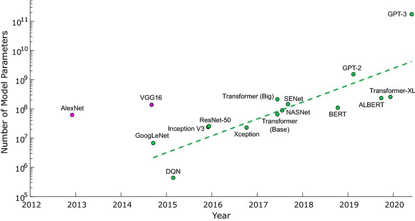

<!-- _class: lead -->

<center>


# Trustworthy AI

<br>

## Lecture 8 - Interpretability


<br>
<br>
<br>

<div class="footnote">

 Image generated by OpenAI dall-e
 *Prompt:* "a robot looks within itself and sees a scary mass of data and mathematical formulas. comic style"

</div> 

</center>

---

## Before we start

* We have **4** lectures left, including today. Last lecture will be on January the 31st.
* Next lecture: **regulating AI** by **Alesia Vallenas**, StEx. 

<br>

> What are some of the legal challenges when it comes to regulating AI? We will be looking at issues concerning anti-discrimination law, data protection and the European Commission's recent AI regulation proposals.

<br>

* We will have a tutorial on Thursday, during which you will receive your last assignment. I suggest everyone participates if possible. 


---

## Neural Networks: Convolutional Neural Nets

<center>


</center>

Each layers' parameters are organized into matrices which are then convolved with the previous layer's output. 

---

## Neural Networks: Parameter space


<center>



</center>

---

<br>
<br>

## **Deep neural networks are black boxes**.

* Why?
* What is lacking from our understanding?
* Are there clear desiderata they do not have?
* Are there "white box" models?


---

## **Deep neural networks are ~~black boxes~~ statistically surprising**

Statistical learning theory (SLT) cannot explain their **generalization capabilities**. 

**Generalization** is the ability to transfer performance from a finite training set to a test set which is sampled from the same distribution. 

SLT proposes to describe various choices for $f$ based on their **complexity**. The lower the complexity, the better generalization guarantees we have. 

---

## Generalization in DNNs

Example SLT technique: **Rademacher complexity**

Given some hypothesis class $\mathcal{F}$ from which our $f$ is sampled, we can define the empirical Rademacher complexity of $\mathcal{F}$ as:

$$ \mathcal{\hat{R}}(\mathcal{F}) = \mathbb{E}_{\sigma} ( sup_{f \in F} \; \frac{1}{n} \sum_{i=1}^n \mathbb{I}[f(x_i) = \sigma_i y_i]) $$

where $\sigma_i$ are random variables $\in \{ -1, 1 \}$. 

---

## Generalization in DNNs

$$ \mathcal{\hat{R}}(\mathcal{F}) = \mathbb{E}_{\sigma} ( sup_{f \in F} \; \frac{1}{n} \sum_{i=1}^n \mathbb{I}[f(x_i) = \sigma_i y_i]) $$

In practice: take some number of $f$ in $\mathcal{F}$; the Rademacher complexity of $\mathcal{F}$ may be computed as the best performance of one $f$ on **randomly labeled data**.

One can then upper bound the expected generalization error of one $f \in \mathcal{F}$ with $\mathcal{\hat{R}}$, up to a constant.

---

## Generalization in DNNs

$$ \mathcal{\hat{R}}(\mathcal{F}) = \mathbb{E}_{\sigma} ( sup_{f \in F} \; \frac{1}{n} \sum_{i=1}^n \mathbb{I}[f(x_i) = \sigma_i y_i]) $$

In practice: take some number of $f$ in $\mathcal{F}$; the Rademacher complexity of $\mathcal{F}$ may be computed as the best performance of one $f$ on a **randomly labeled training set**.

One can then upper bound the expected generalization error of one $f \in \mathcal{F}$ with $\mathcal{\hat{R}}$, up to a constant.

---

## Generalization in DNNs

<center>


From "Understanding Deep Learning Requires Rethinking Generalization", Zhang et al., 2017
</center>

---

## Generalization in DNNs

<center>


</center>

Given enough time, DNNs will perfectly fit random data with shuffled/random pixels, and even random labels. Thus, $\mathcal{\hat{R}}(\mathcal{F}) \simeq 1$ and the bound is only trivial (i.e. not very useful). 

---

## **Deep neural networks are ~~black boxes~~ statistically surprising**

Statistical learning theory (SLT) cannot explain their **generalization capabilities**. 

**Generalization** is the ability to transfer performance from a finite training set to a test set which is sampled from the same distribution.

The number of parameters in neural nets allows them to essentially **memorize** the training set (rote learning), and escapes the mathematical tools of statistical learning theory. 

This only means that current SLT is inadequate to explain DNNs.

---

## **Deep neural networks are ~~black boxes~~ not indentifiable**

Given $f_{\theta}$, we say that $f$ is **identifiable** if the mapping $\theta \to f_{\theta}$ is one-to-one:

$$ f_{\theta_1} = f_{\theta_2} \to \theta_1 = \theta_2  \; \; \, \forall \, \theta_1, \theta_2$$ 

Intuition: in DNNs, we can switch parameters in subsequent layers and obtain the same results. 

---

## **Deep neural networks are ~~black boxes~~ not decomposable**

**Decomposability** is the property of having an intuitive explanation for each part of the model - input, parameters and calculation.

<br>

Examples: rule sets, decision trees, ~linear models.

<br>

Note that highly engineered features (e.g. kernel tricks) may also negatively impact decomposability, even if paired with a decomposable model. 

---

## Rule sets 

Example ruleset for COMPAS:

<br>

```
if ({Prior-Crimes>3}) then ({label=1})
else if ({Age=18-22}) then ({label=1})
else ({label=0})
```

<br>

Around 66% accuracy. Extracted with CORELS https://corels.eecs.harvard.edu/corels/run.html


---

## Decision Trees

Example decision tree for COMPAS:

<br>
´
<center>


</center>

From ``Optimal Sparse Decision Trees'', Hu et al., 2019

---

## **Deep neural networks are ~~black boxes~~ not simulatable**

**Simulatability** is the property of being able to contemplate the entire model at once.

<br>

To fully understand a model, one could posit that it must be possible to reproduce all relevant computational steps in a reasonable amount of time.


* Decision trees: possible, as long as the depth/number of terminals is not big
* Rulesets: same as above, but with the number of extracted rules
* Linear models: depends on the number of features - if we have 1000 columns in our dataset, it is still quite hard to contemplate the whole model. 


---

## Transparency?

<br>

If **transparency** is the ultimate goal, or the "state of being not a black box" is the ultimate goal, are the properties we mentioned so far all that is needed?

* Statistical guarantees of error rates 
* Decomposability
* Simulatability

An alternative: **generating explanations** for **1**. An entire model, or for **2.** Some specific decision undertaken by the model. 

---

## Explaining decisions

<br>

Given a opaque classifier $f$, **local explanation methods** produce an **explanation model** $g \in G$ which **locally approximates** $f$ in the neighborhood of $x$.

<br>

$G$ is taken to be some inherently "transparent" model family, such as a linear classifier or a decision tree. 


---

## Explaining decisions

<br>

Producing an explanation for the decision $\hat{y} = f(x)$ may then be formalized as follows:

<br>

$$\xi(x) = argmin_{g \in G} \, \, \mathcal{L}(f, g, \pi_x) + \Omega(g) $$

<br>

* $\pi_x$: a distance function between $x$ and other points $z$ of the same dimensionality. Used to compute similarity and find a set of neighboring instances.
* $\Omega$: a complexity function. We won't define this formally, but in linear models it may be e.g. the number of non-zero parameters, or the depth of a decision tree.


---

## Explaining decisions

<br>

Producing an explanation for the decision $\hat{y} = f(x)$ may then be formalized as follows:

<br>

$$\xi(x) = argmin_{g \in G} \, \, \mathcal{L}(f, g, \pi_x) + \Omega(g) $$

<br>

* $\mathcal{L}(f, g, \pi_x)$: a measure of how unfaithful $g$ is in approximating $f$ in the locality defined via $\pi_x$. Example: 1-accuracy.  

---

## Explaining decisions

In pseudocode:

1. Select the instance of interest $x$ and obtain the prediction $y = f(x)$.
2. Pick a distance function $\pi_x$ and obtain a number of points $x'_i$ for which $\pi_x < d$ via perturbations of $x$.
3. Obtain predictions $y'_i = f(x_i)$. 
4. Train a transparent model $g$ on the dataset $\{x'_i, y'_i\}$. Optionally, use the distances $d_i$ as weights when learning the classifier. 
5. Obtain $\xi$ by interpreting $g$.  


---

## Expaining decisions


<center>


</center>

* $---$: $g$
* **+**: the instance of interest, positively classified.

---

## Explaining decisions

<center>


</center>

---

## Explaining decisions

Limitations:

* Choosing an appropriate $\pi_x$. How to do that on e.g. images? What is the right threshold $d$?
* **Fidelity**. Does $g$ obtain perfect accuracy on $\{x'_i, y'_i\}$? If not, $g$ is not a perfect local approximation of $f$.

---

## Counterfactual explanations

Idea: instead of **approximating** the decisions of an opaque model, give out a possible scenario in which **another decision** would have been made.

<br>

In general, this is an example of **counterfactual reasoning**. "If X had not occurred, then Y had not occurred". This can be easily connected to feature values: "If your salary was higer, you would have gotten the loan". 

<br>

Also possible to apply this to **significant thresholds** in probability - as an example, we may care when the probability of cancer crosses 20%. 


---

## Counterfactual explanations

The task of producing a counterfactual explanation is to generate an instance $x'$ for which $y' = f(x') \neq y = f(x)$ for some outcome $y'$ one cares about. Furthermore:

* The counterfactual instance $x'$ should be as similar as possible to $x$ - both in distance and in the number of features changed.
* The instance should have feature values which are likely in the dataset - or at least plausible according to the data generating process.


---

## Counterfactual explanations

One possible formalization:

<br>

$$x_{cf} = argmin_{x'} \, \mathcal{L}(x, x', y', \lambda) = argmin_{x'} \lambda \cdot (f(x') - y')^2 + d(x, x')$$ 

<br>

* $(f(x') - y')^2$: squared distance between the prediction of $f$ on $x'$ and the desired outcome $x'$. The higher, the less interested we are in $x'$. 
* $d(x, x')$: distance between $x'$ and $x$, which may be chosen according to different criteria. Most features are similar: L1 distance. As similar as possible: L2 distance. The higher this is, the less we are interested in $x'$. 
* $\lambda$: a tradeoff parameter between the two desiderata. 

---

## Counterfactual explanations

<br>

Limitations:


* Defining a "neighborhood" is again quite challenging for non-tabular data.
<br>
* The interpretation of the explanation must be careful - the lack of a certain feature value (e.g. a higher salary) is not the **cause** for the decision undertaken by the model. As multiple, similarly-valued counterfactuals $x'$ may exist, one should avoid **causal language** when discussing these explanations. 


---

## Limitations in Explanations

In general, there are certain limits to explaining decisions with the methodologies we currently developed.

* The ability to explain any decision may induce **trust** in an opaque model which we still **do not fully understand**. 
* Any explanation model may have limited **fidelity**.


---

## Interpretation vs. Explanation

Another choice: investigating the features learned by "black box" models to try and make sense of their decisions.

<br>

In this space, possible techniques are based on **visualization** and **attribution**.


---

## Feature visualization in CNNs

<br>

<center>


</center>

By visualizing **layers** in a convolutional net, one can get some understanding of what each layer is "doing" in the sense of **which features are being extracted** at each layer. 

---

## Feature visualization in CNNs

Obtaining these images is itself an optimization problem:
<br>

$$

img^* = argmax_{img} \; h_{n, x, y, z}(img)

$$

where $h_{n, x, y, z}$ is the activation of a neuron in the n-th convolutional layer, placed at position $(x, y)$ in channel $z$. 

<br>

We can obtain the image which maximizes the activation of a whole channel (or layer) by adjusting the optimization objective.

---

## Feature visualization in CNNs

<center>


</center>

From Olah et al., "Feature visualization", 2017.


---

## Feature visualization in CNNs

An alternative visualization: **dataset examples** which maximally activate neurons/channels/layers.

<br>
<br>

In practice, dataset examples may be misleading and give the impression that some neurons/channels/layers are more consistent than others.


---

## Feature visualization in CNNs

<center>


</center>

From Olah et al., "Feature visualization", 2017.

---

## Feature visualization and optimization

Note that the optimization problem presented earlier,

$$

img^* = argmax_{img} \; h_{n, x, y, z}(img)

$$

<br>

is an oversimplification of the actual problem research approaches in this area solve to obtain "optimal" images. Various types of regularization are necessary to obtain the images shown in these slides. For a complete (up to ~2017) perspective, see Olah et al. 2017.

---

## Network dissection

Even if some neurons/channels/layers get maximally activated by some image, is there any way to **quantify** this behavior? 

<br>

One possible approach: **network dissection**.

<br>

* Obtain a dataset which is labeled at **pixel-level** with various relevant concepts.
* Compute a threshold value $T_k$ so that the probability of activation $a_k$ of neuron $k$ is $P(a_k > T_k) = 0.005$ or some similarly low value.
* Obtain the binary mask $M_k(x) = a_k \geq T_k$ for each neuron $k$. 
* Compute the **accuracy** of each neuron in detecting concept $c$.
* Neuron $k$ **detects** concept $c$ if its accuracy is over a certain threshold.

---

## Network dissection

Accuracy measure: **intersection over union**.

<br>

$$

IoU_{k, c} = \frac{\sum \mid M_k(X) \, \cap \, L_c(x) \mid }{\sum \mid M_k(x) \, \cup \, L_c(x) \mid }

$$

<br>

where $L_c(x)$ is the pixel-level annotation of image $x$. 

---

## Network dissection

<center>


</center>

It is then possible to visualize which **architectures** and **datasets** lead to more interpretable results.

---

## Network dissection

Limitations:

* Pixel-level labelling is incredibly expensive.
* Neurons may be detectors for **multiple concepts** - thus, any attribution technique suffers from **ambiguity**.

