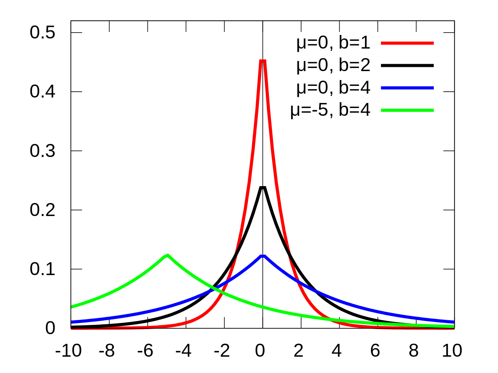
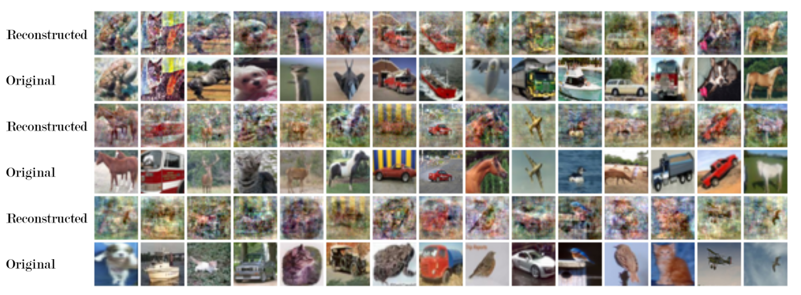
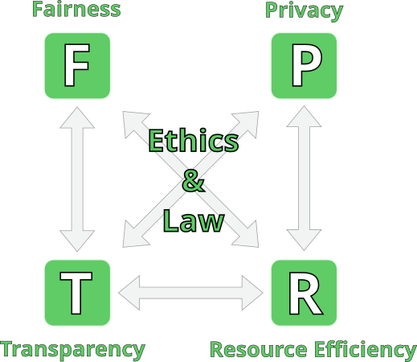

<!-- _class: lead -->

<center>


# Trustworthy AI

<br>

## Lecture 10 
## Differential Privacy (2)


<br>
<br>
<br>

<div class="footnote">

 Image generated by OpenAI dall-e
 *Prompt:* "a robot looks within itself and sees a scary mass of data and mathematical formulas. comic style"

</div> 

</center>

---

## Outline

* Laplace mechanism 
<br>
* Approximate (non-pure) differential privacy
<br>
* Sketches of differentially-private ML
<br>
* Feedback
<br>
* Theses, projects

---

## The Laplace Mechanism

A general way to obtain $\epsilon$-DP guarantees given a non-private function $f$.

<br>

Intuitively, this needs to depend on $f$ somehow: different functions have different baseline privacy.

<br>

Think of mean vs. median: if $n$ is odd, $f$ = median$(x_1 \dots x_n)$ reveals a data point. 

<br>

More in general, functions may be characterized via their **sensitivity**.

---

## Sensitivity

Given $f: \mathcal{X}^n \to \mathbb{R}^k$, the $\ell_1$ sensitivity of $f$:

<br>

$$
\begin{align}
\Delta^f &= \max_{X, X'} \mid \mid f(x) - f(x') \mid \mid_1 \\
&= \max_{X, X'} \sum_j \mid f(x)_j - f(x')_j \mid
\end{align}
$$
<br>

where $X, X'$ are two neighboring datasets and $f(x)_j$ is the $j-$th component of $f$'s output.

---

## Sensitivity

As a simple example, let's analyze the sensitivity of $f(x) = \frac{1}{n} \sum_i x_i$ where $x_i \in \{0, 1\}$.

<br>

This function sums up binary values and could be used to answer queries such as "how many rows in the dataset have some property P?". More concretely, it computes the average value of $x_i$

<br>

It should be straightforward to see that $\Delta^f=\frac{1}{n}$. If $X$ and $X'$ are neighbors, then they can at most differ on one row. 

---

## Laplace Distribution

The Laplace distribution is a probability distribution with two parameters:

* $\mu$ **location**, or mean. We take it to be $0$ in all examples which follow.
* $b$ **scale**. This is related to the variance via $\sigma^2 = 2b^2$.

The probability density function is as follows:

$$
p(x) = \frac{1}{2b} exp(- \frac{\mid x \mid}{b})
$$

---

## Laplace Distribution

It is also often called the **double exponential distribution**:

<center>


</center>


---

## Laplace Distribution

Relating this distribution to other exponentials:

<br>

* **Exponential**. $Exp: x \in [0, \infty), p(x) \propto exp(-cx)$
<br>
* **Laplace**. $Lap: x \in \mathbb{R}, p(x) \propto exp(-c \mid x \mid)$
<br>
* **Gaussian**. $\mathcal{N}: x \in \mathbb{R}, p(x) \propto exp(-c x^2)$


---

## Laplace Mechanism

Given a non-private $f: \mathcal{X}^n \to \mathbb{R}^k$, the Laplace mechanism provides a way to obtain a $\epsilon$-DP algorithm as follows:

<br>

$$
\begin{align}
M(X) &= f(X) + (Y_1 + \dots + Y_k) \\
Y_i &\sim Lap(\frac{\Delta^f}{\epsilon})
\end{align}
$$

<br>

where $\Delta^f$ is the sensitivity of $f$ and $\epsilon$ is the desired level of DP.

---

## Laplace Mechanism - Example

Let us take the previously defined function $f(x) = \frac{1}{n} \sum_i x_i$ where $x_i \in \{0, 1\}$. Note that $k=1$ here. 

<br>

Given $f$, applying the Laplace mechanism gives us $M(x) = f(x) + Y = f(x) + Lap(\frac{1}{n \epsilon})$ as we established $\Delta^f = \frac{1}{n}$ for this algorithm.

<br>

Then, the distribution of $M$ follows $\hat{p} = f(X) + Lap(\frac{1}{n \epsilon})$. 

<br>

We then note that $\mathbb{E}[\hat{p}] = p + \mathbb{E}[Lap(\frac{1}{n \epsilon})] = p$. 

<br>

We conclude that **applying the Laplace mechanism does not change the result - on average**. 


---

## Laplace Mechanism is $\epsilon$-DP

**Claim**: the Laplace mechanism is $\epsilon$-DP. 
**Proof**: take X, Y neighbors and apply the Laplace mechanism to both:

$$
\begin{align}
M(X) \leftarrow p_X(z) \\
M(Y) \leftarrow p_Y(z)
\end{align}
$$

where $M(X) \leftarrow p_X(z)$ means "$M(X)$ has probability density function $p_X(z)$." We take this density to be a Laplacian.

<br>

Now, we hopefully want to see that the ratio of the two densities is bounded by $\epsilon$. If we obtain that, we obtain the proof.

---

## Laplace Mechanism is $\epsilon$-DP

$$
\begin{align}
\frac{p_X(z)}{p_Y(z)} &= \frac{\prod_{i=1}^k exp(- \frac{-\epsilon \mid f(X)_i - z_i \mid}{\Delta})}{\prod_{i=1}^k exp(- \frac{-\epsilon \mid f(Y)_i - z_i \mid}{\Delta})} \\
&= \prod_{i=1}^k exp(+ \frac{\epsilon}{\Delta}(\mid f(Y)_i - z_i \mid - \mid f(X)_i - z_i \mid) \\
&\leq \prod_{i=1}^k exp(\frac{\epsilon}{\Delta}(\mid f(Y)_i - f(X)_i \mid)) \\
&=exp(\frac{\epsilon}{\Delta} \sum_{i=1}^k \mid f(X)_i - f(Y)_i \mid)  \\
&=exp(\frac{\epsilon}{\Delta} \mid \mid f(X)_1 - f(Y)_1 \mid \mid_1) \leq exp(\epsilon)
\end{align}
$$

---

## Laplace Mechanism: Counting queries

To understand the properties of the Laplace mechanism, let us consider counting queries.

<br>

These are queries of the form "how many people in $X$ satisfy $P$?" 

<br>

$$
\begin{align}
f(X) &= \sum_i X_i \\
X_i &=  
\begin{cases} 1 \; \; \; \text{if $P$ holds for $X_i$}, \\ 0 \; \; \; \text{otherwise}  \end{cases}
\end{align}
$$

Two neighbors here either not differ on $P$ - which gives us the same output - or they do differ on $P$ which gives out at most a difference of 1.

Thus, $\Delta^f = 1$.

---

## Laplace Mechanism: Counting Queries

For a single counting query, we can then set up the Laplace mechanism as follows:

$$
\begin{align}
M(X) &= F(X) + Y \\
Y &\sim Lap(\frac{1}{\epsilon})
\end{align}
$$

However, assume we have $k$ counting queries: $f = (f_1 \dots f_k)$. Intuitively, we could set up a Laplace mechanism for each $f_i$. How can we describe the privacy of the overall mechanism for $f$, however?

The answer is provided by the composition theorem.

---

## Laplace Mechanism: Properties

<br>


**Composition theorem**. Suppose $M = (M_1 \dots M_k)$ is a sequence of $\epsilon$-DP algorithms. Then, $M$ is $k \epsilon$-DP.

<br>

**Group Privacy**. If X, X' are **k-neighbors** and $M$ is $\epsilon$-DP, then $Pr[M(X) \in T] \leq e^{k \epsilon} Pr[M(X') \in T]$.

---

## Approximate DP

Let us now generalize the pure-DP definition with $\epsilon$ to the approximate-DP definition with $(\epsilon, \delta)$:

Given $M$ a randomized algorithm which outputs are defined over the range $T$, $M$ is $(\epsilon, \delta)$-DP if we have:

$$
Pr[M(X) \in T] \leq e^{\epsilon} Pr[M(X') \in T] + \delta
$$

Intuitively: $\delta$ represents some probability that "something bad" happens and we release some data.

---

## Approximate DP - Example (1)

As an example:

$$
M(X) =
\begin{cases}
0 \; \; \; \text{with probability } 1 - \delta \\
X \; \; \; \text{with probability } \delta
\end{cases}
$$

<br>

Here, there is one specific case in which everything breaks and we release all the data! Otherwise, we always release nothing ($0$). 

<br>

This algorithm is $(0, \delta)$-DP.

---

## Approximate DP - Example (2)

Another example: the "name and shame" algorithm $NS_{\delta}$.
<br>

$NS_{\delta}$:
```
for each x_i in X:
  with prob. δ,    output x_i
  with prob. 1- δ, do nothing
```

It is straightforward to see that if $\delta > \frac{1}{n}$, we are expected to reveal at least one sample. 

---

## Approximate DP - Example (2)

Another example: the "name and shame" algorithm $NS_{\delta}$.
<br>

$NS_{\delta}$:
```
for each x_i in X:
  with prob. δ,    output x_i
  with prob. 1- δ, do nothing
```

More in general, however, $NS_{\delta}$ is $(0, \delta)$-DP.

---

## Approximate DP - Example (2)

**Claim**: $NS_{\delta}$ is $(0, \delta)$-DP.

**Proof**: let us take $X, X'$ which differ in position $i$ only and are thus neighbors. Let $T$ be a set of datapoints, as per the definition; and let $E$ be the event that the entry $i$ is output. 

First, we notice that conditioned on $\bar{E}$, the distributions of $NS_{\delta}(X)$ and $NS_{\delta}(X')$ are identical - we will release something with the same probability $\delta$. 

Then, we analyze the probability $Pr[NS_{\delta}(X) \in T]$ and try to relate it to $Pr[NS_{\delta}(X') \in T]$. We know that it is possible to interchange them provided that $\bar{E}$ is true.

---

## Approximate DP - Example (2)

$$
\begin{align}
&Pr[NS_{\delta}(X) \in T] \\
(1)&= Pr[NS_{\delta}(X) \in T \mid \bar{E}] \cdot Pr[\bar{E}] + Pr[NS_{\delta}(X) \in T \mid E] \cdot Pr[E] \\
(2)&= Pr[NS_{\delta}(X') \in T \mid \bar{E}] \cdot Pr[\bar{E}] + Pr[NS_{\delta}(X) \in T \mid E] \cdot Pr[E] \\
(3)&\leq Pr[NS_{\delta}(X') \in T \mid \bar{E}] \cdot Pr[\bar{E}] + 1 \cdot \delta \\
(4)&\leq Pr[NS_{\delta}(X') \in T] + \delta
\end{align}
$$

<br>

$(1)$: law of total probability
$(2)$: substitution of X', possible since $\bar{E}$ is true
$(3)$: upper bounding the second half via definition of probability and definition of $NS_{\delta}$
$(4)$: upper bounding $Pr[\bar{E}]$

---

## Properties of Approximate DP

* **Pessimistic**: models the probability that the bound in pure-DP is not true everywhere, but that it may also be false **with small probability**.
* **Reasonable values**: $\delta$ is usually taken to be much lower than $\frac{1}{n}$. 
* **Allows for multiple bounds**: many algorithms can be proven with multiple tradeoffs between $\epsilon$ and $\delta$. E.g. one algorithm could be **both** $(2, 0.00001)$-DP and $(1.5, 0.001)$-DP.
* May be implemented in general via a **Gaussian mechanism**.


---

## Gaussian mechanism

Given $f: \mathcal{X}^n \to \mathbb{R}^k$, the Gaussian mechanism is defined as 

$$
\begin{align}
M(X) &= f(X) + (Y_1 \dots Y_k) \\
Y_i &\sim \mathcal{N}(0, log(\frac{1.25}{\delta}) \frac{\Delta_2}{\epsilon})
\end{align}
$$

where $\mathcal{N}$ is the Gaussian distribution and $\Delta_2$ is the $\ell_2$ sensitivity of $f$. 

With minor differences, group privacy and composition also hold for the Gaussian mechanism

---

## Differentially private ML - sketches

**Problem**: we seek to release $f_{\theta}$. How much does $\theta$ reveal about the training data?

<br>

* **Support vector machines**: usually described via training data points, the "support vectors"
* **Neural nets**: a topic of actual research and not trivial to reconstruct data in practice. However, it is still possible.

---

## Differentially private ML - sketches

<center>



</center>

From https://giladude1.github.io/reconstruction/, NeurIPS 2022


---

## Differentially private ML - sketches

<br>

**Output perturbation**: starting from our usual setup 

$$
\theta^* = arg\min_{\theta} \sum_{i=1}^n \ell(y_i, f_{\theta}(x_i))
$$

Release $M(\theta^*) = \theta^* + b, b \sim \mathcal{N}(0, ...)$

---

## Differentially private ML - sketches

<br>

**Objective perturbation**: change the optimization objective, regularization-style:

$$
\theta^*_{priv} = arg\min_{\theta} \sum_{i=1}^n \ell(y_i, f_{\theta}(x_i)) + <b, \theta>
$$

where $b \sim \mathcal{N}(...)$ and then release $\theta^*_{priv}$.


---

## Differentially private ML - sketches

It is also possible to train neural nets with stochastic gradient descent so that they respect DP definitions.

<br>

However, the results are not quite there yet, especially on bigger datasets (e.g. ImageNet). 

<br>

This is an area of active research!

---

## Feedback!

Thanks for participating and tolerating late opening of assignments, short tutorials... etc.

<br>

I am not sure what is going on with the official university questionnaires. I will post one to our teams chat shortly. If you haven't done it when you take the exam, I will ask you to do it then :) 

<br>

---

## Projects, theses, etc.

<br>
<center>


</center>


---

## Projects, theses, etc.

<center>



</center>

---

## Project, theses, etc.

(show workshop pdf)


---

## Projects, theses, etc.

* **The binary information bottleneck**. I am currently doing some research on revisiting information-theoretic approaches to understanding deep networks. Here, I am looking for people who are willing to learn tensorflow/pytorch and work with me on a few ideas: i) **deep clustering** with neural nets via information maximization; ii) **shadow networks**, i.e. learning a simple binary network which describes a more complex one.

<br>

* **Differential privacy and fairness**. I am looking for a person interested in doing basic research in differential privacy and fairness for neural networks. Can we characterize how much information about sensitive attributes is hidden by using the DP machinery? 

---


