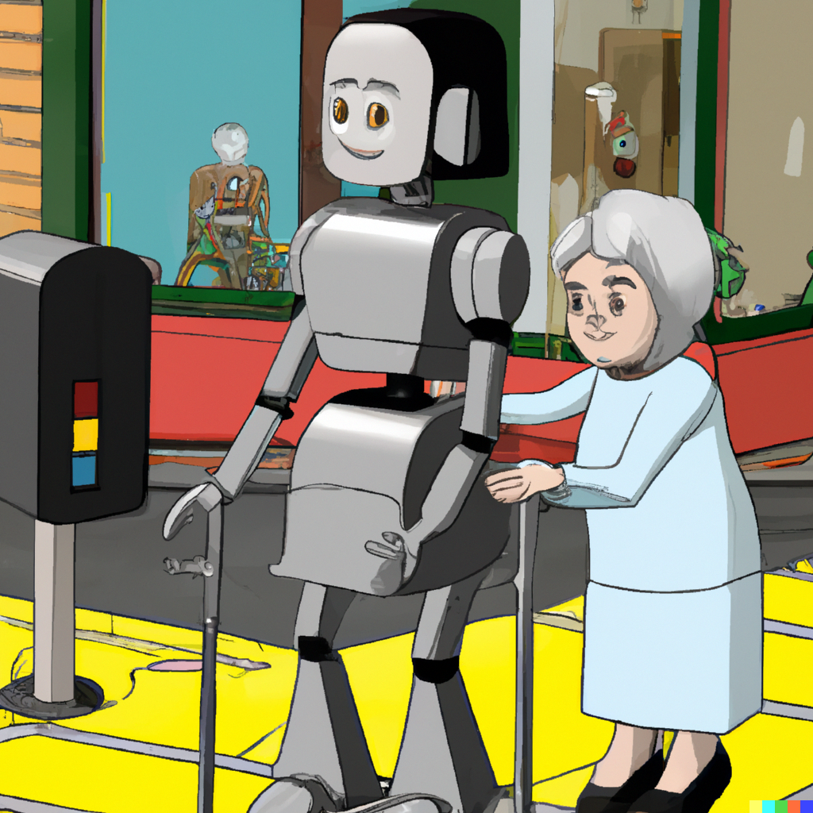

<!-- _class: lead -->

# Trustworthy AI:   Fairness, Interpretability   and Privacy 

## Tutorial 3

 Image generated by OpenAI dall-e
 *Prompt:* "a trustworthy robot helping an old lady cross a busy street, realistic"

 

---

## Essay 1 grades

Essay 1 grades are out.

 

Overall, I am happy with the effort and the resulting essays. We will have more essay assignments. 

 

I would like to highlight some of your efforts, anonymously.

---

## Essay 1 excerpts

 

> The key factor to understand is that the evolvement of socio-technical systems, especially in the visual representation-industry, evolve under the influence of cultural norms and values. The development of technology depends on the needs of industries, that aim to increase profit, and consequently on the demands of the population and the public.  

---

## Essay 1 excerpts

 

> Cognitive Equity is a concept she introduces, and that she would like people (in visual industries) to have. The concept is quite loosely defined, which opens room for a critique of the methodology and scientific validity of the authors’ claim [...] Her proposed concept is still in progress, though, if not measurable or circumscribed, hard to falsify anyway. 

---

## Essay 1 excerpts

 

> The interesting connection between the just stated article of Roth and the often cited article “Machine Bias” by Julia Angwin (2022) is that both essentially deal with the same phenomena. 
A socio-technological dependency between, as the name indicates, technical development and cultural, social, ethnic factors. In both articles this dependency is portrayed as non-obvious by referring to case phenomena. Roth does this with a historical case study, Angwin by informing about the current use of algorithms for crime prediction in U.S. courts. 

---

## Essay 1 excerpts

 

> This furthermore implies that the bias is perhaps not necessarily just part of the software but has become deeply embedded in society, and that there is also work to be done on the social equity side of the equation.

 

> And what is the most problematic about silent bias, is that on a subconscious level it informs our knowledge about the world. The author proposes “cognitive equity” as a solution, through which multiracial equity is embedded into technology, practices and products.Although the work has been done on the technology side of the equation, it still is the socio-cultural domain that needs attention, especially since a lot of what we as a society prefer is indeed a cultural construct and is different from society to society, [...]

---

## Essay 1 excerpts

> In addition to that uncertainty, the process of the algorithms in risk assessment tools in general are still unclear to me after reading the article. This is not surprising of course since the complexity as well as the various reasons to keep them private for business and security reasons go beyond the main point of the article, which is their resulting bias. I tried to find more thorough details on algorithms used for risk assessment to understand them - and possibly the result of the Northpointe study - better, but was unable to find good explanations. This is most likely due to the aforementioned reasons, but also due to the reasoning behind decisions of complex algorithms like this being unclear even to the designers themselves sometimes.

Reading suggestion: "It's COMPASlicated [...]" by Bao et al. https://arxiv.org/abs/2106.05498

---

## Essay 1 excerpts

 

> Another point that was unclear to me is if there was a significant difference between female and male rendering as well. Since the various iterations of "Shirley" were all female, there might exist a bias in that regard as well due to differences in looks, makeup and other possible factors. This in turn could result in an even bigger discrepancy between white women and black men. I tried finding reference cards of men at the time, but only found the various Shirley references. I was unable to find if there was a resulting bias between men and women though [...]

---

## Essay 1 excerpts

 

> Furthermore, Roth identifies three theoretical categories of prototypical changes in the field: **(1)** the “Technological unconscious”, coined by Vaccari (1981), describes the early stages of production technologies. [...] **(2)** The “dysconsciousness” (King, 2001) describes “unquestioned assumptions” (Hall, 1990, p.13), deeply ingrained in society and their individuals [...] **(3)** The “cognitive equity” is introduced by Roth herself and describes a concept in progress which aims to change the perspective on racial equity issues.

---

## Notebook 2

This week, I will also have you complete a shorter notebook. It is a quick introduction to a "fair machine learning" library. https://gitlab.rlp.net/mcerrato/trustworthy-ai-code-assignments

 

Since this is more or less a light load, I suggest you start reading for Essay 2 which will be assigned in a week. 

 

The essay will have the same structure and is going to be based on "Raw Data is an Oxymoron", which is already in our MS team. 

